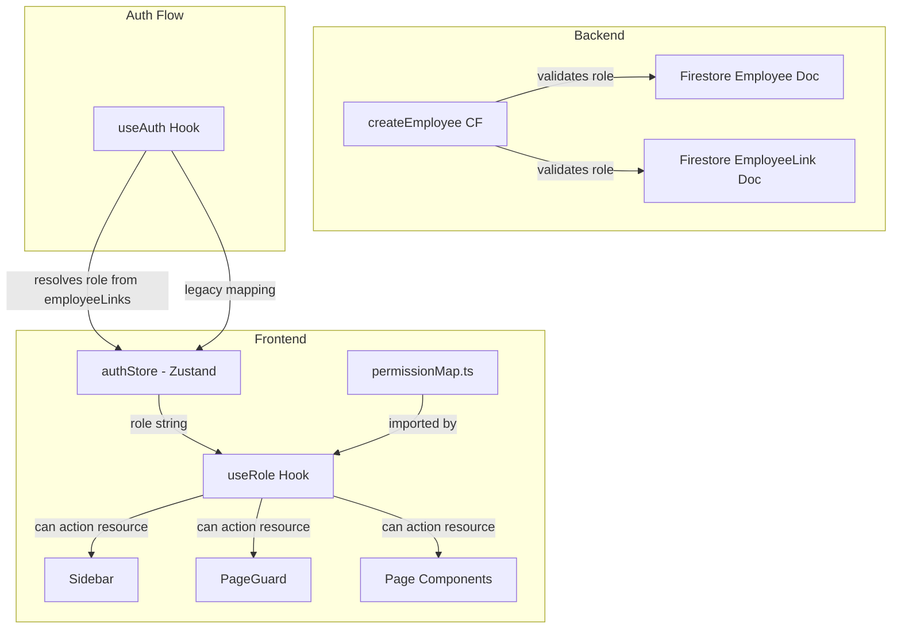

# Design Document: Employee Roles

## Overview

This design replaces PingFlow's generic three-role system (`admin | manager | employee`) with five granular gym-staff roles: `admin`, `branch_manager`, `trainer`, `sales_executive`, and `receptionist`. The core change is a centralized, type-safe Permission Map that drives all access decisions — sidebar visibility, page-level guards, and action-level (CRUD) button rendering. The existing `useRole` hook is enhanced with a `can(action, resource)` API that reads from this map. The cloud function `createEmployee` is updated to accept and validate the new role values, and a legacy migration layer maps old `'manager'` → `'branch_manager'` and `'employee'` → `'receptionist'` at the hook level.

### Key Design Decisions

1. **Single Permission Map as source of truth** — A TypeScript `Record<UserRole, PermissionSet>` enforces compile-time completeness. Adding a role without defining its permissions is a type error.
2. **Frontend-only enforcement for UI** — Sidebar filtering, page guards, and button visibility are all driven by the `useRole` hook. Firestore Security Rules remain branch-scoped (existing rules already restrict employee writes to assigned branches).
3. **Legacy mapping in the hook, not in Firestore** — Old role values are mapped at read-time in `useRole`. This avoids a risky batch migration and lets admins confirm/change roles at their own pace via the edit form.
4. **No new Firestore collections** — The permission map lives in frontend code. Employee documents keep their existing structure with only the `role` field values changing.

## Architecture



### Data Flow

1. **Login**: `useAuth` reads `employeeLinks/{uid}` → gets `role` string → stores in `authStore`.
2. **Permission Check**: `useRole` reads `role` from store → maps legacy values → looks up `PERMISSION_MAP[role]` → exposes `can(action, resource)`.
3. **Sidebar**: Reads `PERMISSION_MAP[role].sidebarItems` to filter visible nav items.
4. **Page Guard**: A `<PageGuard resource="billing">` wrapper checks `can('read', 'billing')` before rendering children.
5. **Action Buttons**: Components call `can('create', 'members')` to show/hide Add, Edit, Delete buttons.
6. **Employee Creation**: Admin selects role in form → `createEmployee` CF validates role is one of the four non-admin values → writes to both Firestore docs.

## Components and Interfaces

### 1. Permission Map (`frontend/src/config/permissionMap.ts`) — NEW

```typescript
// CRUD action types
export type CrudAction = 'create' | 'read' | 'update' | 'delete';

// Special actions beyond CRUD
export type SpecialAction = 'checkin'; // update lastVisitDate only

export type Action = CrudAction | SpecialAction;

// All resources in the system
export type Resource =
  | 'dashboard' | 'members' | 'plans' | 'billing'
  | 'automations' | 'broadcast' | 'expenses' | 'analytics'
  | 'employees' | 'branches' | 'activity' | 'settings';

// Sidebar item keys (subset of Resource that appears in nav)
export type SidebarItem = Resource;

// Permission set for a single role
export interface PermissionSet {
  sidebarItems: SidebarItem[];
  actions: Record<Resource, Action[]>;
}

// The map itself — keyed by UserRole, enforced at compile time
export const PERMISSION_MAP: Record<UserRole, PermissionSet> = {
  admin: {
    sidebarItems: ['dashboard','members','plans','billing','automations','broadcast','expenses','analytics','employees','branches','activity','settings'],
    actions: {
      dashboard: ['read'],
      members: ['create','read','update','delete','checkin'],
      plans: ['create','read','update','delete'],
      billing: ['create','read','update','delete'],
      automations: ['read'],
      broadcast: ['create','read','update','delete'],
      expenses: ['create','read','update','delete'],
      analytics: ['read'],
      employees: ['create','read','update','delete'],
      branches: ['create','read','update','delete'],
      activity: ['read'],
      settings: ['read','update'],
    },
  },
  branch_manager: {
    sidebarItems: ['dashboard','members','plans','billing','automations','broadcast'],
    actions: {
      dashboard: ['read'],
      members: ['create','read','update','delete','checkin'],
      plans: ['create','read','update','delete'],
      billing: ['create','read','update','delete'],
      automations: ['read'],
      broadcast: ['create','read','update','delete'],
      expenses: [],
      analytics: [],
      employees: [],
      branches: [],
      activity: [],
      settings: [],
    },
  },
  trainer: {
    sidebarItems: ['dashboard','members'],
    actions: {
      dashboard: ['read'],
      members: ['read','checkin'],
      plans: [],
      billing: [],
      automations: [],
      broadcast: [],
      expenses: [],
      analytics: [],
      employees: [],
      branches: [],
      activity: [],
      settings: [],
    },
  },
  sales_executive: {
    sidebarItems: ['dashboard','members','billing'],
    actions: {
      dashboard: ['read'],
      members: ['create','read'],
      plans: [],
      billing: ['create','read'],
      automations: [],
      broadcast: [],
      expenses: [],
      analytics: [],
      employees: [],
      branches: [],
      activity: [],
      settings: [],
    },
  },
  receptionist: {
    sidebarItems: ['dashboard','members','plans'],
    actions: {
      dashboard: ['read'],
      members: ['read','checkin'],
      plans: ['read'],
      billing: [],
      automations: [],
      broadcast: [],
      expenses: [],
      analytics: [],
      employees: [],
      branches: [],
      activity: [],
      settings: [],
    },
  },
};
```

### 2. Updated `UserRole` Type (`frontend/src/types/index.ts`)

```typescript
export type UserRole = 'admin' | 'branch_manager' | 'trainer' | 'sales_executive' | 'receptionist';
```

The legacy values `'manager'` and `'employee'` are removed from the type. A mapping utility handles them at runtime.

### 3. Enhanced `useRole` Hook (`frontend/src/hooks/useRole.ts`)

```typescript
import { useAuthStore } from '@/store/authStore';
import { PERMISSION_MAP, type Action, type Resource } from '@/config/permissionMap';
import type { UserRole } from '@/types';

// Maps legacy role strings to new roles
const LEGACY_ROLE_MAP: Record<string, UserRole> = {
  manager: 'branch_manager',
  employee: 'receptionist',
};

function resolveRole(raw: string): UserRole {
  if (raw in LEGACY_ROLE_MAP) return LEGACY_ROLE_MAP[raw];
  if (raw in PERMISSION_MAP) return raw as UserRole;
  return 'receptionist'; // safest default — most restrictive
}

export function useRole() {
  const { role: rawRole } = useAuthStore();
  const role = resolveRole(rawRole);
  const permissions = PERMISSION_MAP[role];

  const can = (action: Action, resource: Resource): boolean => {
    return permissions.actions[resource]?.includes(action) ?? false;
  };

  return {
    role,
    can,
    sidebarItems: permissions.sidebarItems,
    isAdmin: role === 'admin',
  };
}
```

### 4. PageGuard Component (`frontend/src/components/layout/PageGuard.tsx`) — NEW

```typescript
interface PageGuardProps {
  resource: Resource;
  children: React.ReactNode;
}

export function PageGuard({ resource, children }: PageGuardProps) {
  const { can } = useRole();
  if (!can('read', resource)) {
    return <AccessDenied />;
  }
  return <>{children}</>;
}
```

Wraps each page route inside `AppShell` to block unauthorized access before any data fetching occurs.

### 5. Updated Sidebar (`frontend/src/components/layout/Sidebar.tsx`)

The `allNavItems` array gains a `resource` field. Filtering changes from role-string matching to:

```typescript
const { sidebarItems } = useRole();
const navItems = allNavItems.filter(item => sidebarItems.includes(item.resource));
```

### 6. Updated Employee Forms (Create & Edit)

The role dropdown changes from `manager | employee` to:

| Value | Display Label |
|---|---|
| `branch_manager` | Branch Manager |
| `trainer` | Trainer |
| `sales_executive` | Sales Executive |
| `receptionist` | Receptionist |

For employees with legacy roles, the edit form shows the mapped new role pre-selected.

### 7. Updated `createEmployee` Cloud Function

Adds role validation:

```typescript
const VALID_EMPLOYEE_ROLES = ['branch_manager', 'trainer', 'sales_executive', 'receptionist'];

// In the handler:
const { gymId, name, email, phone, password, assignedBranches, role } = request.data;
if (!role || !VALID_EMPLOYEE_ROLES.includes(role)) {
  throw new HttpsError('invalid-argument', `Invalid role. Must be one of: ${VALID_EMPLOYEE_ROLES.join(', ')}`);
}
// Write `role` (instead of hardcoded 'employee') to both docs
```

## Data Models

### Updated `Employee` Interface

```typescript
export interface Employee {
  id?: string;
  uid: string;
  name: string;
  email: string;
  phone?: string;
  role: UserRole;              // was 'admin' | 'employee' | 'manager'
  assignedBranches?: string[];
  isActive: boolean;
  createdAt: Timestamp;
}
```

### Updated `UserRole` Type

```typescript
export type UserRole = 'admin' | 'branch_manager' | 'trainer' | 'sales_executive' | 'receptionist';
```

### Firestore Document Structures (unchanged paths)

**Employee Document** — `gyms/{gymId}/employees/{uid}`
```json
{
  "uid": "abc123",
  "name": "Ravi Kumar",
  "email": "ravi@example.com",
  "phone": "9876543210",
  "role": "trainer",
  "assignedBranches": ["branch1"],
  "isActive": true,
  "createdAt": "<Timestamp>"
}
```

**EmployeeLink Document** — `employeeLinks/{uid}`
```json
{
  "gymId": "owner-uid",
  "name": "Ravi Kumar",
  "email": "ravi@example.com",
  "role": "trainer",
  "assignedBranches": ["branch1"],
  "isActive": true
}
```

### Legacy Role Mapping (runtime, not persisted)

| Stored Value | Resolved To |
|---|---|
| `'manager'` | `'branch_manager'` |
| `'employee'` | `'receptionist'` |
| any unknown | `'receptionist'` |


## Correctness Properties

*A property is a characteristic or behavior that should hold true across all valid executions of a system — essentially, a formal statement about what the system should do. Properties serve as the bridge between human-readable specifications and machine-verifiable correctness guarantees.*

### Property 1: Permission map completeness

*For any* valid `UserRole` value and *for any* `Resource` value, `PERMISSION_MAP[role]` shall have a defined `sidebarItems` array and `PERMISSION_MAP[role].actions[resource]` shall be a defined array (possibly empty).

**Validates: Requirements 2.1, 2.2**

### Property 2: `can()` faithfully reflects the permission map

*For any* valid `UserRole`, *for any* `Action`, and *for any* `Resource`, `can(action, resource)` shall return `true` if and only if `PERMISSION_MAP[role].actions[resource].includes(action)` is `true`.

**Validates: Requirements 3.1, 3.3**

### Property 3: `resolveRole` always returns a valid UserRole

*For any* arbitrary string input, `resolveRole(input)` shall return a value that is a key in `PERMISSION_MAP`. Specifically, `'manager'` maps to `'branch_manager'`, `'employee'` maps to `'receptionist'`, any unknown string maps to `'receptionist'`, and all five valid UserRole strings map to themselves.

**Validates: Requirements 3.4, 9.1, 9.2, 9.3**

### Property 4: Sidebar filtering matches permission map

*For any* valid `UserRole`, the set of sidebar items displayed shall be exactly equal to `PERMISSION_MAP[role].sidebarItems`.

**Validates: Requirements 4.1, 4.2, 4.3, 4.4, 4.5, 4.6**

### Property 5: Role validation accepts exactly the four valid employee roles

*For any* string, the `createEmployee` role validation shall accept the string if and only if it is one of `'branch_manager'`, `'trainer'`, `'sales_executive'`, `'receptionist'`. All other strings (including `'admin'`, empty string, and arbitrary values) shall be rejected.

**Validates: Requirements 1.3, 1.4, 7.4, 7.5**

### Property 6: Action button visibility matches permission check

*For any* valid `UserRole`, *for any* `Resource`, and *for any* CRUD action (`'create'`, `'update'`, `'delete'`), the corresponding action button (Add/Edit/Delete) shall be rendered if and only if `can(action, resource)` returns `true` for the current role.

**Validates: Requirements 6.1, 6.2, 6.3, 6.4, 6.5, 6.6**

## Error Handling

### Invalid Role Values

| Scenario | Handling |
|---|---|
| `authStore` contains unknown role string | `resolveRole()` returns `'receptionist'` (most restrictive) |
| `createEmployee` receives invalid role | Cloud Function throws `HttpsError('invalid-argument', ...)` with descriptive message |
| `createEmployee` receives `'admin'` as role | Rejected — admin is not a valid employee role |
| Employee doc has legacy `'manager'` value | Mapped to `'branch_manager'` at read-time by `resolveRole()` |
| Employee doc has legacy `'employee'` value | Mapped to `'receptionist'` at read-time by `resolveRole()` |

### Permission Denied Scenarios

| Scenario | Handling |
|---|---|
| User navigates to unauthorized page | `PageGuard` renders `<AccessDenied />` — no data fetched |
| User somehow triggers unauthorized action | `can()` returns `false` — button is hidden/disabled, action blocked |
| Non-admin calls `createEmployee` CF | Cloud Function throws `HttpsError('permission-denied', ...)` |

### Data Consistency

| Scenario | Handling |
|---|---|
| Employee doc and EmployeeLink doc have different roles | `useAuth` reads from `employeeLinks` (the source of truth for login resolution). Admin can fix via edit form. |
| Role update fails on one of the two docs | Frontend updates both docs in sequence. If the second write fails, a toast error is shown and the admin can retry. |

## Testing Strategy

### Property-Based Tests (fast-check)

The project will use [fast-check](https://github.com/dubzzz/fast-check) for property-based testing with Vitest. Each property test runs a minimum of 100 iterations.

| Property | What It Tests | Generator Strategy |
|---|---|---|
| Property 1: Permission map completeness | Every role × resource has defined arrays | Enumerate all UserRole values × all Resource values |
| Property 2: `can()` reflects permission map | Hook logic matches map lookup | Generate random (role, action, resource) triples |
| Property 3: `resolveRole` returns valid role | Legacy mapping + unknown handling | Generate arbitrary strings including legacy values, valid roles, and random strings |
| Property 4: Sidebar filtering | Nav items match map | Generate random UserRole values, compare filtered items to map |
| Property 5: Role validation | CF accepts exactly 4 valid roles | Generate arbitrary strings, check acceptance matches the valid set |
| Property 6: Action button visibility | UI rendering matches `can()` | Generate (role, resource, action) triples, verify button presence |

### Unit Tests (Vitest)

- Permission map snapshot tests for each role's exact permissions (Requirements 2.4–2.8)
- `resolveRole('manager')` → `'branch_manager'` and `resolveRole('employee')` → `'receptionist'` (Requirements 9.1, 9.2)
- Employee creation form renders 4 role options (Requirement 7.1)
- Employee creation form blocks submission without role (Requirement 7.2)
- Employee edit form pre-populates current role (Requirement 8.1)
- PageGuard renders AccessDenied for unauthorized roles (Requirement 5.1)
- PageGuard does not render children when access denied (Requirement 5.2)

### Integration Tests

- Employee creation flow: admin creates employee with role → verify both Firestore docs contain correct role (Requirements 7.3, 8.3)
- Role change flow: admin edits employee role → employee re-logs in → verify new permissions apply (Requirement 8.4)
- Legacy employee login: employee with `'manager'` role in Firestore → verify they see branch_manager sidebar items (Requirement 9.4)

### Test Configuration

```typescript
// vitest.config.ts addition
// Property tests tagged with feature and property number:
// Feature: employee-roles, Property 1: Permission map completeness
// Minimum 100 iterations per property test
```
