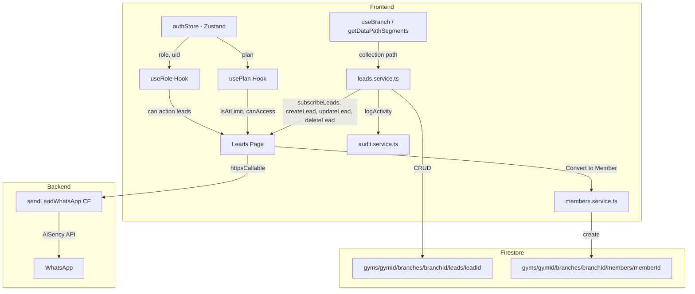

# Design Document: Lead Management

## Overview

This design adds a full lead pipeline to PingFlow — tracking prospective gym members from initial contact through conversion to active membership. Leads are branch-scoped Firestore documents with seven pipeline stages (`New → Contacted → Trial Scheduled → Trial Done → Negotiation → Converted → Lost`). The system integrates with the existing RBAC model via `permissionMap.ts`, the plan-based gating system via `planConfig.ts`, and WhatsApp messaging via AiSensy for quick lead outreach. A "Convert to Member" flow bridges the lead pipeline to the existing member management system.

### Key Design Decisions

1. **Branch-scoped leads collection** — Leads live at `gyms/{gymId}/branches/{branchId}/leads`, following the same pattern as members, plans, and payments. The `getDataPathSegments()` helper resolves the correct path for single/multi-branch gyms.
2. **Trainer privacy via client-side filtering** — Trainers see only their assigned leads or unassigned `New` leads. Filtering happens in the React component after the Firestore subscription returns all branch leads. This avoids complex per-trainer Firestore queries while the existing security rules already restrict branch-level access.
3. **Phone masking as a pure utility function** — A `maskPhone(phone: string)` function masks all phone numbers in the UI regardless of role. The real phone number is passed to the WhatsApp Cloud Function, never exposed in the display layer.
4. **Conversion creates a Member, does not delete the Lead** — The lead document is retained with `status: 'Converted'` for analytics (heatmap). The member document is created via the existing `createMember` service.
5. **WhatsApp quick action via Cloud Function** — A new `sendLeadWhatsApp` callable Cloud Function sends a template message using the server-side AiSensy API key, following the same pattern as `sendBroadcast`.
6. **Heatmap computed client-side** — The conversion heatmap aggregates from the already-subscribed leads collection, avoiding extra Firestore queries. Pro-only gating uses the existing `canAccess('leads_analytics')` pattern.
7. **Existing Firestore security rules already cover leads** — The wildcard rule `gyms/{gymId}/branches/{branchId}/{subcollection}/{docId}` already grants admin full access and employees access to their assigned branches. No new rules are needed.

## Architecture



### Data Flow

1. **Lead Subscription**: `Leads` page mounts → calls `subscribeLeads(gymId)` → real-time listener on `leads` collection ordered by `createdAt desc` → leads stored in component state.
2. **Trainer Filtering**: If `role === 'trainer'`, the component filters the subscribed leads array to show only leads where `assignedTo === uid` OR (`assignedTo === null` AND `status === 'New'`). Converted/Lost leads are excluded.
3. **Lead CRUD**: Create/Update/Delete operations go through `leads.service.ts` → Firestore write → audit log via `logActivity()`.
4. **Claim Lead**: Trainer clicks "Claim" → `updateLead(gymId, leadId, { assignedTo: uid })` → audit log.
5. **WhatsApp Quick Action**: User clicks WhatsApp icon → `httpsCallable('sendLeadWhatsApp')({ gymId, leadId, phone, name })` → Cloud Function sends AiSensy template → success/error toast.
6. **Convert to Member**: User clicks "Convert" → modal with plan selector → on confirm: `createMember(gymId, { name, phone, planId, ... })` → `updateLead(gymId, leadId, { status: 'Converted' })` → audit log.
7. **Plan Gating**: Before showing "Add Lead" button, check `isAtLimit('leads', activeLeadCount)`. If at limit and not pro, show `UpgradeModal`.
8. **Heatmap**: Pro users see a `ConversionHeatmap` component that filters leads with `status === 'Converted'` and groups by `assignedTo` and `source`.

## Components and Interfaces

### 1. Type Definitions (`frontend/src/types/index.ts`) — ADDITIONS

```typescript
// ─── Lead ───────────────────────────────────────────────────────────────────

export type LeadStatus = 'New' | 'Contacted' | 'Trial Scheduled' | 'Trial Done' | 'Negotiation' | 'Converted' | 'Lost';

export type LeadSource = 'Social Media' | 'Walk-in' | 'Referral';

export interface LeadNote {
  text: string;
  createdBy: string;   // UID
  createdAt: Timestamp;
}

export interface Lead {
  id?: string;
  name: string;
  phone: string;          // E.164 format
  email?: string;
  source: LeadSource;
  status: LeadStatus;
  assignedTo: string | null;  // UID or null
  trialDate: Timestamp | null;
  notes: LeadNote[];
  createdAt: Timestamp;
  updatedAt: Timestamp;
}
```

### 2. Permission Map Update (`frontend/src/config/permissionMap.ts`)

Add `'leads'` to the `Resource` type union:

```typescript
export type Resource =
  | 'dashboard' | 'members' | 'plans' | 'billing'
  | 'automations' | 'broadcast' | 'expenses' | 'analytics'
  | 'employees' | 'branches' | 'activity' | 'settings'
  | 'leads';
```

Permission assignments per role:

| Role | Actions on `leads` | In `sidebarItems`? |
|---|---|---|
| `admin` | `create`, `read`, `update`, `delete` | Yes |
| `branch_manager` | `create`, `read`, `update`, `delete` | Yes |
| `trainer` | `read`, `update` | Yes |
| `sales_executive` | `create`, `read`, `update` | Yes |
| `receptionist` | `read` | No |

### 3. Plan Configuration Update (`frontend/src/config/planConfig.ts`)

Add `'leads'` to `ResourceName` and `FeatureName`:

```typescript
export type FeatureName =
  | 'billing' | 'automations' | 'broadcast' | 'expenses'
  | 'analytics' | 'globalView' | 'leads' | 'leads_analytics';

export type ResourceName = 'members' | 'employees' | 'branches' | 'leads';
```

Updated limits and features:

```typescript
export const PLAN_LIMITS: Record<PlanType, PlanLimits> = {
  trial:   { members: Infinity, employees: Infinity, branches: Infinity, leads: 50 },
  starter: { members: 100, employees: 2, branches: 1, leads: 50 },
  pro:     { members: Infinity, employees: Infinity, branches: Infinity, leads: Infinity },
};

export const PLAN_FEATURES: Record<PlanType, FeatureName[]> = {
  trial:   ['billing', 'automations', 'broadcast', 'expenses', 'analytics', 'globalView', 'leads'],
  starter: ['billing', 'automations', 'leads'],
  pro:     ['billing', 'automations', 'broadcast', 'expenses', 'analytics', 'globalView', 'leads', 'leads_analytics'],
};
```

### 4. Lead Service (`frontend/src/services/leads.service.ts`) — NEW

Follows the same pattern as `members.service.ts` and `billing.service.ts`:

```typescript
// Collection helpers using getDataPathSegments()
function leadsCollection(_gymId: string) {
  const segs = getDataPathSegments();
  return collection(db, segs[0], segs[1], ...segs.slice(2), 'leads');
}

function leadDoc(_gymId: string, leadId: string) {
  const segs = getDataPathSegments();
  return doc(db, segs[0], segs[1], ...segs.slice(2), 'leads', leadId);
}
```

**Exported functions:**

| Function | Signature | Description |
|---|---|---|
| `subscribeLeads` | `(gymId, onData, onError) → Unsubscribe` | Real-time listener, ordered by `createdAt desc` |
| `createLead` | `(gymId, data: CreateLeadInput) → Promise<string>` | Creates lead with defaults (`status: 'New'`, `assignedTo: null`), logs to audit |
| `updateLead` | `(gymId, leadId, data: Partial<Lead>) → Promise<void>` | Updates specified fields + `updatedAt`, logs to audit |
| `deleteLead` | `(gymId, leadId) → Promise<void>` | Deletes lead document, logs to audit |
| `claimLead` | `(gymId, leadId, trainerUid, trainerName) → Promise<void>` | Sets `assignedTo` to trainer UID, logs claim to audit |

**CreateLeadInput interface:**

```typescript
interface CreateLeadInput {
  name: string;
  phone: string;
  email?: string;
  source: LeadSource;
  trialDate?: Date | null;
  notes?: string;  // Initial note text, if provided
}
```

### 5. Phone Masking Utility (`frontend/src/lib/utils.ts`) — ADDITION

```typescript
/**
 * Masks a phone number showing only first 2 and last 2 digits.
 * E.g., "+919876543210" → "98******10", "9876543210" → "98******10"
 */
export function maskPhone(phone: string): string {
  const digits = phone.replace(/\D/g, '');
  // Strip country code if present (91 prefix for 12-digit numbers)
  const local = digits.length === 12 && digits.startsWith('91')
    ? digits.slice(2)
    : digits;
  if (local.length < 4) return local;
  const first2 = local.slice(0, 2);
  const last2 = local.slice(-2);
  const masked = '*'.repeat(local.length - 4);
  return `${first2}${masked}${last2}`;
}
```

### 6. Leads Page (`frontend/src/pages/Leads.tsx`) — NEW

The main page component with the following structure:

```
┌─────────────────────────────────────────────────────┐
│  Leads Pipeline                        [+ Add Lead] │
├─────────────────────────────────────────────────────┤
│  Status Tabs: New | Contacted | Trial Scheduled |   │
│  Trial Done | Negotiation | Converted | Lost        │
├─────────────────────────────────────────────────────┤
│  ┌─────────────────────────────────────────────┐    │
│  │ Lead Card                                    │    │
│  │ Name: John Doe          Source: Walk-in      │    │
│  │ Phone: 98******10       Trainer: Ravi K.     │    │
│  │ Trial: 15 Apr 2026                           │    │
│  │ [WhatsApp] [Edit] [Claim] [Convert]          │    │
│  └─────────────────────────────────────────────┘    │
│  ...more lead cards...                              │
├─────────────────────────────────────────────────────┤
│  Conversion Heatmap (Pro only)                      │
│  ┌──────────────────┐  ┌──────────────────┐         │
│  │ By Trainer        │  │ By Source         │         │
│  │ Ravi: 12          │  │ Walk-in: 15       │         │
│  │ Priya: 8          │  │ Referral: 10      │         │
│  └──────────────────┘  └──────────────────┘         │
└─────────────────────────────────────────────────────┘
```

**Key behaviors:**
- Status tabs filter the leads list by `status`
- Trainers see a filtered subset (assigned to them + unassigned New)
- Trainers don't see Converted/Lost tabs
- "Add Lead" button gated by `can('create', 'leads')` AND plan limit check
- "Edit" button gated by `can('update', 'leads')`
- "Delete" button gated by `can('delete', 'leads')`
- "Claim" button shown only for trainers on unassigned New leads
- "Convert to Member" button shown for users with `update` permission, hidden if already Converted
- WhatsApp icon button on every lead card
- Conversion Heatmap section shown only when `canAccess('leads_analytics')` (Pro plan)

### 7. Add/Edit Lead Modal

A `Drawer` or `Modal` component (reusing existing `Drawer` component) with form fields:

| Field | Type | Required | Notes |
|---|---|---|---|
| Name | text input | Yes | |
| Phone | text input | Yes | Formatted to E.164 via `formatPhoneE164()` |
| Email | email input | No | |
| Source | select dropdown | Yes | Options: Social Media, Walk-in, Referral |
| Status | select dropdown | Edit only | All 7 statuses (hidden on create — defaults to New) |
| Assigned To | select dropdown | Edit only | List of employees for the branch |
| Trial Date | date picker | No | |
| Notes | textarea | No | On create: becomes first note entry. On edit: appends new note. |

### 8. Convert to Member Modal

A `Modal` component triggered by the "Convert to Member" button:

1. Displays lead name and phone (read-only)
2. Plan selector dropdown (fetches plans from `plans` subcollection)
3. Start date picker (defaults to today)
4. On confirm:
   - Calls `createMember(gymId, { name, phone, planId, planName, startDate, endDate, lastVisitDate: null })`
   - Calls `updateLead(gymId, leadId, { status: 'Converted' })`
   - Logs conversion to audit trail
   - Shows success toast
   - Closes modal

### 9. WhatsApp Quick Action Cloud Function (`functions/src/whatsapp/sendLeadWhatsApp.ts`) — NEW

```typescript
// Callable Cloud Function: sendLeadWhatsApp
// Input: { gymId, phone, leadName }
// Uses server-side AISENSY_API_KEY
// Sends the 'pingflow_lead_followup' template
// Returns: { success: boolean, error?: string }
```

Follows the same pattern as `sendBroadcast`:
- Validates auth and input
- Reads API key from `process.env.AISENSY_API_KEY`
- Cleans phone number (strip non-digits, add `91` prefix if 10 digits)
- Sends via AiSensy API with template params `[leadName, gymName]`
- Returns success/error

### 10. Sidebar Update (`frontend/src/components/layout/Sidebar.tsx`)

Add a new entry to `allNavItems`:

```typescript
{ icon: Icons.leads, label: 'Leads', path: '/leads', resource: 'leads', feature: 'leads' }
```

Position it after Members in the nav order. Add a `leads` SVG icon to the `Icons` object (a funnel/pipeline icon).

### 11. App.tsx Route Update

```typescript
const LeadsPage = lazy(() => import('@/pages/Leads'));

// Inside AppShell routes:
<Route path="/leads" element={<PageGuard resource="leads"><LeadsPage /></PageGuard>} />
```

### 12. Audit Action Types Update (`frontend/src/services/audit.service.ts`)

Add new action types:

```typescript
export type ActionType =
  | ... // existing types
  | 'LEAD_ADDED'
  | 'LEAD_UPDATED'
  | 'LEAD_DELETED'
  | 'LEAD_CLAIMED'
  | 'LEAD_WHATSAPP_SENT'
  | 'LEAD_CONVERTED';
```

## Data Models

### Lead Document — `gyms/{gymId}/branches/{branchId}/leads/{leadId}`

```json
{
  "name": "Priya Sharma",
  "phone": "+919876543210",
  "email": "priya@example.com",
  "source": "Walk-in",
  "status": "New",
  "assignedTo": null,
  "trialDate": null,
  "notes": [
    {
      "text": "Interested in 3-month plan",
      "createdBy": "trainer-uid-123",
      "createdAt": "<Timestamp>"
    }
  ],
  "createdAt": "<Timestamp>",
  "updatedAt": "<Timestamp>"
}
```

### Firestore Indexes (`firestore.indexes.json`)

Add composite index:

```json
{
  "collectionGroup": "leads",
  "queryScope": "COLLECTION",
  "fields": [
    { "fieldPath": "status", "order": "ASCENDING" },
    { "fieldPath": "createdAt", "order": "DESCENDING" }
  ]
}
```

### Firestore Security Rules

The existing wildcard rules already cover the leads subcollection:

```
// This existing rule handles leads under branches:
match /gyms/{gymId}/branches/{branchId}/{subcollection}/{docId} {
  allow read, write: if isAdmin(gymId);
  allow read, write: if isLinkedEmployee(gymId) && employeeHasBranch(branchId);
}
```

No new rules are needed. Admin gets full access, and employees with the branch in their `assignedBranches` get read/write access. Unauthenticated users are denied by the `isAdmin` and `isLinkedEmployee` checks which both require `request.auth != null`.


## Correctness Properties

*A property is a characteristic or behavior that should hold true across all valid executions of a system — essentially, a formal statement about what the system should do. Properties serve as the bridge between human-readable specifications and machine-verifiable correctness guarantees.*

### Property 1: Lead creation produces a complete document with correct defaults

*For any* valid lead creation input (random name, random E.164 phone, random LeadSource), calling `createLead` shall produce a document containing all required fields (`name`, `phone`, `source`, `status`, `assignedTo`, `notes`, `createdAt`, `updatedAt`) with `status` defaulting to `'New'` and `assignedTo` defaulting to `null`.

**Validates: Requirements 1.2, 1.4, 3.3**

### Property 2: Trainer lead visibility filter

*For any* array of leads with random `assignedTo` and `status` values, and *for any* trainer UID, the trainer filter shall return only leads where (`assignedTo` equals the trainer's UID) OR (`assignedTo` is null AND `status` is `'New'`). The filtered result shall never contain leads with `status` of `'Converted'` or `'Lost'`.

**Validates: Requirements 5.1, 5.2**

### Property 3: Admin and Branch Manager see all leads

*For any* array of leads with random statuses and assignments, when the current role is `'admin'` or `'branch_manager'`, the filter shall return the entire unmodified array.

**Validates: Requirements 5.3**

### Property 4: Claim lead sets assignedTo to trainer UID

*For any* trainer UID and *for any* unassigned lead (where `assignedTo` is null), calling the claim operation shall result in the lead's `assignedTo` field being set to exactly the trainer's UID.

**Validates: Requirements 6.2**

### Property 5: Phone number masking

*For any* phone number string of 10 or more digits, `maskPhone` shall return a string where only the first 2 and last 2 digits of the local number are visible, and all middle digits are replaced with `*`. The output length (digit characters + asterisks) shall equal the local number length.

**Validates: Requirements 8.1, 8.2**

### Property 6: Lead-to-member conversion data integrity

*For any* lead with random name and phone, and *for any* valid plan selection, converting the lead shall produce a member document with `name` equal to the lead's name, `phone` equal to the lead's phone, and the selected plan. The lead's `status` shall be set to `'Converted'` after conversion.

**Validates: Requirements 10.2, 10.3**

### Property 7: Plan limit gating for lead creation

*For any* active lead count and *for any* plan type, lead creation shall be blocked (return true from `isAtLimit`) if and only if the plan is not `'pro'` AND the active lead count is greater than or equal to the plan's lead limit (50 for trial/starter). For `'pro'` plans, creation shall never be blocked regardless of count.

**Validates: Requirements 11.3, 11.4**

### Property 8: Conversion heatmap computation accuracy

*For any* array of leads with random statuses, `assignedTo` values, and `source` values, the heatmap computation shall count only leads with `status === 'Converted'`. The sum of counts grouped by `assignedTo` shall equal the total number of converted leads, and the sum of counts grouped by `source` shall also equal the total number of converted leads.

**Validates: Requirements 12.1, 12.2, 12.4**

### Property 9: Lead card displays required fields

*For any* lead with random `name`, `source`, `assignedTo` (mapped to a trainer name), and `trialDate`, the rendered lead card output shall contain the lead's name, source label, trainer name (or "Unassigned"), and formatted trial date (or empty if null).

**Validates: Requirements 7.2**

### Property 10: Audit trail logging on lead operations

*For any* lead CRUD operation (create, update, delete, claim, convert), the operation shall produce a corresponding audit log entry with the correct `actionType` and a `description` containing the lead's name.

**Validates: Requirements 3.6, 6.3, 9.5, 10.5**

## Error Handling

### Lead CRUD Errors

| Scenario | Handling |
|---|---|
| `createLead` fails (Firestore write error) | Toast error: "Failed to add lead. Please try again." No audit log written. |
| `updateLead` on non-existent lead | Toast error: "Lead not found." |
| `deleteLead` on non-existent lead | Silent no-op (Firestore `deleteDoc` doesn't throw for missing docs) |
| `claimLead` on already-assigned lead | Frontend hides the Claim button for assigned leads. If a race condition occurs, the update succeeds (last-write-wins) and the audit log reflects the new assignee. |

### Conversion Errors

| Scenario | Handling |
|---|---|
| `createMember` fails during conversion | Toast error: "Failed to create member. Lead was not converted." Lead status remains unchanged. |
| `updateLead` fails after member creation | Toast warning: "Member created but lead status update failed. Please manually update the lead." The member document exists; the lead can be manually set to Converted. |
| Lead already has `status: 'Converted'` | "Convert to Member" button is hidden. If somehow triggered, the service checks status and returns early with a toast: "This lead has already been converted." |

### WhatsApp Quick Action Errors

| Scenario | Handling |
|---|---|
| Cloud Function `sendLeadWhatsApp` not authenticated | `HttpsError('unauthenticated')` — frontend shows "Please log in again." |
| AiSensy API key not configured | `HttpsError('failed-precondition')` — frontend shows "WhatsApp not configured. Contact admin." |
| AiSensy API returns error | Cloud Function returns `{ success: false, error: '...' }` — frontend shows error toast with the message. |
| Network error calling Cloud Function | Frontend catches the error and shows "Network error. Please try again." |

### Plan Gating Errors

| Scenario | Handling |
|---|---|
| Active lead count >= 50 on starter/trial | "Add Lead" button triggers `UpgradeModal` instead of the add form. Message: "You've reached the 50 active lead limit. Upgrade to Pro for unlimited leads." |
| Plan data not yet loaded | "Add Lead" button is disabled until plan data resolves. |

### Permission Errors

| Scenario | Handling |
|---|---|
| User without `read` on leads navigates to `/leads` | `PageGuard` renders Access Denied page. No data fetched. |
| User without `create` on leads | "Add Lead" button not rendered. |
| User without `update` on leads | "Edit", "Claim", "Convert" buttons not rendered. Status change controls hidden. |
| User without `delete` on leads | "Delete" button not rendered. |

## Testing Strategy

### Property-Based Tests (fast-check + Vitest)

The project will use [fast-check](https://github.com/dubzzz/fast-check) for property-based testing with Vitest. Each property test runs a minimum of 100 iterations.

| Property | What It Tests | Generator Strategy |
|---|---|---|
| Property 1: Lead creation defaults | `createLead` produces complete doc with correct defaults | Generate random `{ name: fc.string(), phone: fc.stringMatching(/\+91\d{10}/), source: fc.constantFrom('Social Media','Walk-in','Referral') }` |
| Property 2: Trainer filter | Only assigned-to-self or unassigned-New leads returned, never Converted/Lost | Generate random arrays of leads with `fc.constantFrom(...)` for status and `fc.option(fc.uuid())` for assignedTo, plus a random trainer UID |
| Property 3: Admin sees all | No filtering applied for admin/branch_manager | Same lead array generator, verify output length equals input length |
| Property 4: Claim sets assignedTo | Claim operation sets correct UID | Generate random UIDs via `fc.uuid()`, verify assignedTo matches |
| Property 5: Phone masking | First 2 and last 2 digits visible, rest masked | Generate random digit strings of length 10-12 via `fc.stringOf(fc.constantFrom(...digits), {minLength:10, maxLength:12})` |
| Property 6: Conversion integrity | Member gets lead's name/phone, lead status becomes Converted | Generate random lead objects and plan objects |
| Property 7: Plan limit gating | Blocked iff not-pro AND count >= limit | Generate random `{ plan: fc.constantFrom('trial','starter','pro'), count: fc.nat({max:200}) }` |
| Property 8: Heatmap computation | Counts only Converted leads, sums match total | Generate random lead arrays with varying statuses, assignedTo, and source values |
| Property 9: Lead card fields | Rendered output contains name, source, trainer, date | Generate random lead objects, verify all fields present in output |
| Property 10: Audit logging | Each CRUD op produces correct audit entry | Generate random operations, verify audit log entries |

### Unit Tests (Vitest)

- Permission map: verify exact actions for each role on `leads` resource (Requirements 4.2–4.6)
- Permission map: verify `sidebarItems` includes `leads` for admin, branch_manager, trainer, sales_executive (Requirement 4.7)
- Permission map: verify `sidebarItems` excludes `leads` for receptionist (Requirement 4.7)
- Plan config: verify `PLAN_LIMITS.leads` is 50 for trial/starter, Infinity for pro (Requirement 11.2)
- Plan config: verify `PLAN_FEATURES` includes `leads` for all plans and `leads_analytics` only for pro (Requirements 11.1, 12.3)
- Claim button visibility: renders for trainer on unassigned New lead, hidden for assigned leads (Requirements 6.1, 6.4)
- Convert button visibility: hidden when lead status is Converted (Requirement 10.6)
- Lead document retained after conversion (Requirement 10.4)
- WhatsApp button renders for each lead (Requirement 9.1)
- Success/error toast on WhatsApp send (Requirements 9.3, 9.4)
- Leads route exists at `/leads` with PageGuard (Requirement 14.2)
- Leads page is lazy-loaded (Requirement 14.4)

### Integration Tests

- Full lead lifecycle: create → update status → claim → convert to member → verify both documents (Requirements 3.3, 3.4, 6.2, 10.2, 10.3)
- WhatsApp Cloud Function: mock AiSensy API, verify correct payload sent (Requirement 9.2)
- Firestore security rules: admin can CRUD leads, employee with branch can CRUD leads, unauthenticated user denied (Requirements 13.1, 13.2, 13.3)
- Sidebar navigation: leads item visible for correct roles, hidden for receptionist (Requirements 14.1, 4.7)
- PageGuard: user without leads read permission sees Access Denied (Requirement 14.3)

### Test Configuration

```typescript
// vitest.config.ts
// Property tests tagged with feature and property number:
// Feature: lead-management, Property 1: Lead creation produces a complete document with correct defaults
// Minimum 100 iterations per property test

// fast-check configuration:
// fc.assert(fc.property(...), { numRuns: 100 })
```
