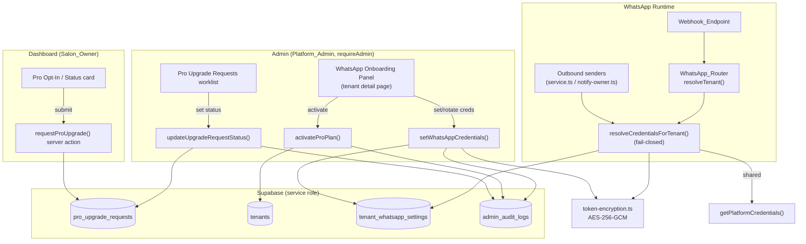

# Design Document

## Overview

This feature delivers the Pro plan (₹999/mo billed yearly, single branch, dedicated WhatsApp Business API number) for SnipandGlow tenants using an **assisted (manual) onboarding** model. There is no Meta BSP / Embedded Signup integration in this phase: the Salon_Owner expresses intent and pays, the SnipandGlow Platform_Admin performs the Meta setup out-of-band, and then stores the salon's dedicated `phone_number_id`, `waba_id`, and AES-256-GCM-encrypted access token in the existing `tenant_whatsapp_settings` table with `mode='dedicated'`.

The design touches three layers that already exist in the codebase:

1. **Dashboard (Salon_Owner)** — a Pro opt-in surface under `src/app/(dashboard)/` that creates a `Pro_Upgrade_Request` and shows current Pro status. No credential entry here.
2. **Admin (Platform_Admin)** — an upgrade-request worklist plus a per-tenant `WhatsApp_Onboarding_Panel` on `src/app/admin/tenants/[id]/page.tsx` for activating Pro and setting/rotating dedicated credentials. All guarded by `requireAdmin`.
3. **WhatsApp runtime** — the `WhatsApp_Router` (`src/lib/whatsapp/tenant-router.ts`) and the `Webhook_Endpoint` (`src/app/api/whatsapp/webhook/route.ts`), upgraded to resolve and use per-tenant dedicated credentials for both outbound and inbound, with strict isolation and no silent fallback to the Shared_Number.

The central new piece of logic is **secure credential resolution**: a single server module that decrypts a tenant's token (or fails closed) and returns the exact credentials to use. Two TODO placeholders already exist in `tenant-router.ts` (`resolveTenant` dedicated branch and `getCredentialsForTenant`) where dedicated mode currently falls back to platform credentials — this design replaces those placeholders with real decryption and a fail-closed contract.

### Research Notes (grounding in existing code)

- **Encryption pattern already exists.** `functions/src/whatsapp/crypto.util.ts` (Firebase functions codebase) implements exactly the storage format this design needs: AES-256-GCM, 12-byte IV, 16-byte auth tag, key from `TOKEN_ENCRYPTION_KEY` (64 hex chars = 32 bytes), output `base64(IV ‖ ciphertext ‖ authTag)`. The Next.js app (`snipglow/`) has no equivalent yet, so we port the same algorithm into `src/lib/crypto/token-encryption.ts`. Reusing the identical format keeps tokens encrypted in one codebase decryptable in the other if needed.
- **Schema is already in place.** Migration `014_whatsapp_multi_tenant.sql` defines `tenant_whatsapp_settings` with `mode`, `waba_id`, `phone_number_id`, `display_phone_number`, `access_token_encrypted`, `display_name_status`, `webhook_status`, `booking_slug`, plus a unique index on `tenant_id` and an index on `phone_number_id`. No schema change is needed for credentials (Requirement 9.4). Only one new table is required for `Pro_Upgrade_Request`.
- **Tenant columns are already present.** Migration `001_core_tables.sql` defines `plan_tier` (`starter|pro|enterprise`), `subscription_status` (`trial|active|past_due|expired|cancelled`), `subscription_start`, `subscription_end`, `razorpay_subscription_id`, `razorpay_customer_id`. Pro activation writes only these (Requirement 3.6) so a future Razorpay automation reuses the same fields.
- **Admin auth + audit are established.** `src/lib/admin/auth.ts` exposes `requireAdmin()` (redirects non-admins) and `logAdminAction(...)` (writes to `admin_audit_logs`, service-role only). Every admin mutation in this feature reuses these.
- **Outbound send is centralized.** `sendMessage(credentials, to, payload)` in `src/lib/whatsapp/templates.ts` posts to `graph.facebook.com/{phoneNumberId}/messages` with `Bearer {accessToken}`. All higher-level senders in `service.ts` and `notify-owner.ts` accept/derive `WhatsAppCredentials`. The single chokepoint for per-tenant routing is therefore credential resolution, not each call site.
- **Test tooling exists.** `snipglow/package.json` already includes `vitest@^4` and `fast-check@^4.7.0` with a `test` script (`vitest --run`). Property-based testing is supported out of the box.

## Architecture



### Key architectural decisions

1. **Fail-closed credential resolution (Requirements 4.5, 6.5).** Today `getCredentialsForTenant` and the dedicated branch of `resolveTenant` silently fall back to `getPlatformCredentials()`. This design changes that: for a `dedicated` tenant whose token cannot be decrypted, resolution returns `null` and the caller withholds the message and records a delivery failure. A dedicated tenant is **never** served from the Shared_Number, because doing so would send a Pro customer's message from the platform number — a branding and isolation violation.

2. **Single resolution chokepoint.** All outbound credential decisions funnel through one function, `resolveCredentialsForTenant(tenantId)`, in `src/lib/whatsapp/credentials.ts`. This guarantees Requirement 6.3/6.4 (every message type resolves per tenant, never cross-tenant) without auditing every call site, and gives one place to property-test.

3. **Encryption is a pure, self-contained module.** `token-encryption.ts` exposes `encryptToken`/`decryptToken` with no I/O, making the round-trip and fail-closed behavior directly property-testable. The IV is generated per-encryption and stored inline with the ciphertext (Requirement 4.4), so callers never manage IVs.

4. **Connection status is derived, not stored (Requirement 8).** `deriveConnectionStatus(settings)` is a pure function of `mode`, `phone_number_id`, and presence of `access_token_encrypted`. Nothing new is persisted; the status is computed wherever it is displayed, keeping it always consistent with the underlying credentials.

5. **Dashboard cannot touch credentials (Requirements 4.7, 9.1, 9.3).** The opt-in surface only writes `pro_upgrade_requests`. Credential create/view/rotate and Pro activation are server actions colocated under `src/app/admin/...` and begin with `await requireAdmin()`, so a non-admin caller is redirected before any work occurs.

6. **Idempotent opt-in (Requirement 1.6).** A partial unique index on `pro_upgrade_requests (tenant_id)` filtered to open statuses (`requested`, `in_progress`) makes duplicate active requests impossible at the database level; the action detects the existing row and returns its status instead of erroring.

## Components and Interfaces

### 1. Token encryption — `src/lib/whatsapp/token-encryption.ts` (new)

Ports the proven AES-256-GCM format from `functions/src/whatsapp/crypto.util.ts` into the Next.js app.

```ts
// AES-256-GCM. Storage format: base64( IV[12] ‖ ciphertext[N] ‖ authTag[16] )
// Key: process.env.TOKEN_ENCRYPTION_KEY, 64 hex chars (32 bytes).

export class TokenEncryptionKeyError extends Error {}   // missing/invalid key
export class TokenDecryptionError extends Error {}       // tamper / wrong key / corrupt

/** @throws TokenEncryptionKeyError if key missing or not 64 hex chars */
export function encryptToken(plaintext: string): string;

/** @throws TokenEncryptionKeyError if key missing; TokenDecryptionError if undecryptable */
export function decryptToken(encrypted: string): string;

/** Non-throwing helper used by resolution: returns null instead of throwing. */
export function tryDecryptToken(encrypted: string | null | undefined): string | null;

/** True when a key is configured and valid (used to reject submissions early, Req 4.9). */
export function isEncryptionKeyConfigured(): boolean;
```

### 2. Credential resolution — `src/lib/whatsapp/credentials.ts` (new; replaces TODOs in `tenant-router.ts` and `service.ts`)

```ts
import type { WhatsAppCredentials } from './config';

export type CredentialResolution =
  | { kind: 'dedicated'; credentials: WhatsAppCredentials }
  | { kind: 'shared'; credentials: WhatsAppCredentials }
  | { kind: 'unavailable'; reason: 'decrypt_failed' | 'missing_token' | 'no_platform_creds' };

/**
 * Resolve the exact credentials to use for a tenant's outbound message.
 * - dedicated + decryptable token -> { dedicated }   (Req 6.1)
 * - dedicated + token present but undecryptable -> { unavailable: 'decrypt_failed' }  (Req 4.5, 6.5)
 * - dedicated + no token -> { unavailable: 'missing_token' }                           (Req 6.5)
 * - shared (or no settings) -> platform credentials                                    (Req 6.2)
 * Never returns another tenant's credentials; never returns shared for a dedicated tenant. (Req 6.4)
 */
export async function resolveCredentialsForTenant(tenantId: string): Promise<CredentialResolution>;
```

`WhatsAppCredentials` for a dedicated tenant is built as `{ accessToken: decrypted, phoneNumberId: settings.phone_number_id, businessAccountId: settings.waba_id }`.

### 3. Connection status — `src/lib/whatsapp/connection-status.ts` (new)

```ts
export type WhatsAppConnectionStatus = 'not_connected' | 'pending' | 'connected';

export interface WhatsAppSettingsView {
  mode: 'shared' | 'dedicated' | null;
  phone_number_id: string | null;
  access_token_encrypted: string | null;
}

/** Pure derivation (Req 8.2–8.4). */
export function deriveConnectionStatus(s: WhatsAppSettingsView | null): WhatsAppConnectionStatus;

/** Masked token indicator for display (Req 4.8, 8.6): returns a boolean-backed label, never the token. */
export function maskTokenIndicator(s: WhatsAppSettingsView | null): 'Stored (hidden)' | 'Not set';
```

### 4. WhatsApp_Router changes — `src/lib/whatsapp/tenant-router.ts` (modified)

- **Dedicated branch of `resolveTenant`**: after looking up the tenant by `phone_number_id` with `mode='dedicated'`, call `resolveCredentialsForTenant(tenant.id)`. If `kind === 'dedicated'`, return the `TenantContext` with those credentials. If unavailable, return `null` (the message cannot be answered from the wrong number — Req 7.2). The current `getPlatformCredentials()` placeholder is removed from this branch.
- **`getCredentialsForTenant`**: re-implemented on top of `resolveCredentialsForTenant`, returning `null` for `unavailable` instead of falling back to platform.
- **Shared branch unchanged** except that it remains the only path that returns platform credentials; it must not be reached for a dedicated `phone_number_id` (Req 7.4) — guaranteed by the leading `isSharedNumber(phoneNumberId)` check.

### 5. Webhook_Endpoint changes — `src/app/api/whatsapp/webhook/route.ts` (modified)

- Unknown `phone_number_id` (not shared, no matching dedicated tenant) → `resolveTenant` returns `null`; the handler must **not** attribute the message to any tenant (Req 7.3). The existing `sendFallbackMessage` path is acceptable for the shared number; for a truly unknown dedicated id we simply log unattributed and stop.
- The inbound log row (`whatsapp_sessions`) is stamped with `tenant_id` only after successful resolution (Req 7.5) — this already happens; we keep it and ensure dedicated-resolved messages set the same field.

### 6. Server actions

| Action | File | Guard | Writes | Audit action |
|---|---|---|---|---|
| `requestProUpgrade(contactPhone)` | `src/app/(dashboard)/dashboard/billing/pro-actions.ts` | authenticated tenant user | `pro_upgrade_requests` (idempotent) | — (tenant action, not admin) |
| `listUpgradeRequests()` | `src/app/admin/pro-requests/actions.ts` | `requireAdmin` | — | `view_pro_requests` |
| `updateUpgradeRequestStatus(id, status)` | same | `requireAdmin` | `pro_upgrade_requests.status` | `update_pro_request_status` |
| `activateProPlan(tenantId)` | `src/app/admin/tenants/[id]/pro-actions.ts` | `requireAdmin` | `tenants` (plan/status/start/end) | `activate_pro_plan` |
| `setWhatsAppCredentials(tenantId, {phoneNumberId, wabaId, displayPhoneNumber, accessToken?})` | same | `requireAdmin` | `tenant_whatsapp_settings` (+encrypt token) | `set_whatsapp_credentials` |
| `rotateWhatsAppToken(tenantId, accessToken)` | same | `requireAdmin` | `tenant_whatsapp_settings.access_token_encrypted` | `rotate_whatsapp_token` |

All admin actions follow the established shape: `const user = await requireAdmin();` → mutate via `createAdminClient()` → `await logAdminAction({...})` → `revalidatePath(...)`. Audit metadata for credential actions includes `phone_number_id` and resulting `mode` but **never** the plaintext or encrypted token (Requirements 5.4, 4.3).

### 7. UI surfaces

- **Dashboard Pro card** (client component under billing): shows ₹999/mo billed yearly + "own WhatsApp Business API number" + "single branch" when `plan_tier !== 'pro'` (Req 1.1); shows current Pro status when `plan_tier === 'pro'` (Req 1.7); on submit calls `requestProUpgrade`, then renders confirmation (Req 1.4) or error (Req 1.5); if an open request already exists, renders its status (Req 1.6).
- **Admin Pro requests page** `src/app/admin/pro-requests/page.tsx`: table of all requests with `tenant_id`, salon name, contact phone, timestamp, status, and a status selector (Req 2.1, 2.2).
- **Admin WhatsApp_Onboarding_Panel** on the tenant detail page: shows `WhatsApp_Connection_Status`, `plan_tier`, `subscription_status` (Req 8.1, 8.5); for connected tenants shows `display_phone_number`, `phone_number_id`, `waba_id`, and the masked token indicator (Req 8.6); provides "Activate Pro", "Set Credentials", and "Rotate Token" controls.

## Data Models

### New table: `pro_upgrade_requests` (migration `025_pro_upgrade_requests.sql`)

```sql
CREATE TABLE IF NOT EXISTS pro_upgrade_requests (
  id          UUID PRIMARY KEY DEFAULT gen_random_uuid(),
  tenant_id   UUID NOT NULL REFERENCES tenants(id) ON DELETE CASCADE,
  contact_phone TEXT NOT NULL,
  status      TEXT NOT NULL DEFAULT 'requested'
                CHECK (status IN ('requested', 'in_progress', 'completed', 'cancelled')),
  created_at  TIMESTAMPTZ NOT NULL DEFAULT now(),
  updated_at  TIMESTAMPTZ NOT NULL DEFAULT now()
);

-- At most one OPEN request per tenant (Req 1.6). Closed requests don't block new ones.
CREATE UNIQUE INDEX IF NOT EXISTS idx_pro_request_open
  ON pro_upgrade_requests(tenant_id)
  WHERE status IN ('requested', 'in_progress');

CREATE INDEX IF NOT EXISTS idx_pro_request_status ON pro_upgrade_requests(status, created_at DESC);

-- Service-role only, consistent with admin_audit_logs (018).
ALTER TABLE pro_upgrade_requests ENABLE ROW LEVEL SECURITY;
REVOKE ALL ON pro_upgrade_requests FROM PUBLIC, anon, authenticated;
GRANT ALL ON pro_upgrade_requests TO service_role;
```

TypeScript view model:

```ts
export type ProUpgradeStatus = 'requested' | 'in_progress' | 'completed' | 'cancelled';

export interface ProUpgradeRequest {
  id: string;
  tenant_id: string;
  contact_phone: string;
  status: ProUpgradeStatus;
  created_at: string;
  updated_at: string;
}
```

### Reused: `tenant_whatsapp_settings` (no schema change — Requirement 9.4)

| Column | Role in this feature |
|---|---|
| `mode` | `'shared'` (platform) or `'dedicated'` (Pro). Set to `'dedicated'` on credential entry (Req 4.1). |
| `phone_number_id` | Dedicated number id; inbound routing key (Req 7.1) and outbound `phoneNumberId`. |
| `waba_id` | Dedicated WABA id; outbound `businessAccountId`. |
| `access_token_encrypted` | `base64(IV ‖ ciphertext ‖ authTag)` Encrypted_Token (Req 4.2). Never plaintext (Req 4.3). |
| `display_phone_number` | Human-readable number shown in the panel for connected tenants (Req 8.6). |
| `display_name_status`, `webhook_status`, `booking_slug` | Preserved unchanged for future Embedded Signup phase (Req 9.4). |

One row per tenant (existing unique index `idx_tenant_whatsapp_tenant`); credential writes use upsert on `tenant_id`.

### Reused: `tenants` (no schema change — Requirement 3.6)

Pro activation sets `plan_tier='pro'`, `subscription_status='active'`, `subscription_start=now()`, `subscription_end=now()+1 year`. `razorpay_subscription_id` / `razorpay_customer_id` remain available for the future automated payment integration to populate the same row.

### Reused: `admin_audit_logs` (no schema change)

Every admin mutation writes a row via `logAdminAction` with `admin_email`, `action`, `target_type='tenant'`, `target_id=tenant_id`, and a token-free `metadata` object.

### Encrypted token format

```
plaintext ──encryptToken──▶ base64( IV[12 bytes] ‖ ciphertext[N] ‖ authTag[16 bytes] )
                                     └──── stored verbatim in access_token_encrypted ────┘
base64(...) ──decryptToken──▶ plaintext        (IV read from the first 12 bytes — Req 4.4)
```

## Correctness Properties

*A property is a characteristic or behavior that should hold true across all valid executions of a system — essentially, a formal statement about what the system should do. Properties serve as the bridge between human-readable specifications and machine-verifiable correctness guarantees.*

The reasoning below traces each property back to the prework. Property-based testing applies here because the core logic — token encryption, fail-closed credential resolution, multi-tenant isolation, status derivation, masking, idempotent opt-in, and date computation — consists of pure functions over large input spaces (arbitrary token bytes, arbitrary settings shapes, arbitrary tenant sets, arbitrary timestamps). UI rendering, authorization redirects, audit side-effects, and schema/scope constraints are handled by example/integration/smoke tests in the Testing Strategy instead.

### Property 1: Token encryption round-trip

*For any* token string, decrypting the result of encrypting it (with a configured key) yields the original token exactly; this holds equally for a freshly set token and for a rotated (replacement) token.

**Validates: Requirements 4.2, 4.4, 4.6**

### Property 2: Ciphertext does not leak the plaintext token

*For any* token string, the Encrypted_Token produced by encryption is not equal to the plaintext and does not contain the plaintext as a substring, and the value persisted to `access_token_encrypted` is the Encrypted_Token rather than the plaintext.

**Validates: Requirements 4.2, 4.3**

### Property 3: Missing or invalid encryption key rejects without storing

*For any* token string, when the Token_Encryption_Key is not configured (missing or not a valid 64-hex-char key), encryption raises a `TokenEncryptionKeyError` and the credential submission is rejected without writing `access_token_encrypted`.

**Validates: Requirements 4.9**

### Property 4: Fail-closed resolution for unusable dedicated tokens

*For any* dedicated tenant whose `access_token_encrypted` is missing or cannot be decrypted (corrupted, tampered, or wrong key), credential resolution returns an `unavailable` result and never returns the Platform_Credentials or any other tenant's credentials; the outbound path therefore withholds the message and records a delivery failure instead of sending from the Shared_Number.

**Validates: Requirements 4.5, 6.5**

### Property 5: Dedicated credentials match the tenant and are isolated

*For any* collection of distinct dedicated tenants each with a decryptable token, resolving credentials for a given tenant returns `dedicated` credentials whose `phoneNumberId` and `businessAccountId` equal that tenant's own `phone_number_id` and `waba_id`, whose `accessToken` equals that tenant's decrypted token, and which never equal another tenant's credentials or the Platform_Credentials.

**Validates: Requirements 6.1, 6.3, 6.4**

### Property 6: Shared mode resolves to platform credentials

*For any* tenant whose WhatsApp_Settings are absent or have `mode='shared'`, credential resolution returns the Platform_Credentials.

**Validates: Requirements 6.2**

### Property 7: Inbound webhook routing is exact and isolated

*For any* `phone_number_id`: if it matches a stored dedicated `phone_number_id`, the WhatsApp_Router resolves to exactly that owning tenant; if it is neither the Shared_Number nor any stored dedicated `phone_number_id`, the Router resolves to no tenant (null); and for the Shared_Number the Router uses shared-mode resolution and never selects a tenant solely because that tenant owns a dedicated `phone_number_id`.

**Validates: Requirements 7.1, 7.2, 7.3, 7.4**

### Property 8: Connection status derivation

*For any* WhatsApp_Settings value, the derived WhatsApp_Connection_Status is exactly one of `not_connected`, `pending`, or `connected`, where: absent settings or `mode='shared'` ⇒ `not_connected`; `mode='dedicated'` with a `phone_number_id` but no Encrypted_Token ⇒ `pending`; and `mode='dedicated'` with a `phone_number_id` and a stored Encrypted_Token ⇒ `connected`.

**Validates: Requirements 8.1, 8.2, 8.3, 8.4**

### Property 9: Audit metadata excludes tokens

*For any* credential-change inputs (phone_number_id, waba_id, plaintext token, encrypted token), the metadata object built for the Admin_Audit_Log entry contains neither the plaintext Access_Token nor the Encrypted_Token in any field.

**Validates: Requirements 5.4, 4.3**

### Property 10: Token is only ever shown masked

*For any* WhatsApp_Settings value, the token-masking indicator returns one of its fixed labels (a stored/not-set indicator) and never contains the decrypted Access_Token or the Encrypted_Token.

**Validates: Requirements 4.8, 8.6**

### Property 11: Pro opt-in is idempotent

*For any* tenant that already has an open Pro_Upgrade_Request (status `requested` or `in_progress`), submitting another upgrade request creates no additional record and returns the existing request's current status.

**Validates: Requirements 1.6**

### Property 12: Activation sets a one-year subscription window

*For any* activation instant `t`, Pro activation records `subscription_start = t` and `subscription_end = t + exactly one year`, so the end date is always one year after the recorded start date.

**Validates: Requirements 3.3**

## Error Handling

| Scenario | Handling | Requirement |
|---|---|---|
| Encryption key missing/invalid at submit time | `isEncryptionKeyConfigured()` checked first; `setWhatsAppCredentials`/`rotateWhatsAppToken` return `{ success:false, error:'TOKEN_ENCRYPTION_KEY is not configured' }`; nothing written | 4.9 |
| Stored token undecryptable (tamper/wrong key/corrupt) | `tryDecryptToken` returns `null`; `resolveCredentialsForTenant` → `unavailable('decrypt_failed')`; outbound withholds + logs delivery failure; inbound dedicated reply suppressed | 4.5, 6.5, 7.2 |
| Dedicated tenant with no token yet | `unavailable('missing_token')`; status shows `pending`; no send via platform | 6.5, 8.3 |
| Platform credentials unset (shared path) | `resolveCredentialsForTenant` → `unavailable('no_platform_creds')`; caller logs failure (existing behavior of `getPlatformCredentials()` returning null preserved) | 6.2 |
| Duplicate Pro opt-in (race) | Partial unique index `idx_pro_request_open` rejects the second insert; action catches the unique violation and returns the existing request's status | 1.6 |
| Upgrade-request create failure (DB error) | Action returns `{ success:false, error }`; UI shows error, not confirmation | 1.5 |
| Non-admin calls any admin action/page | `requireAdmin()` redirects to `/admin/login` or `/admin/forbidden` before any read/write | 2.4, 3.5, 4.7 |
| Invalid status value on request update | DB CHECK constraint rejects; action returns validation error | 2.2 |
| Unknown inbound `phone_number_id` | `resolveTenant` returns null; message logged unattributed, no tenant association | 7.3 |

Errors that occur inside the WhatsApp runtime never escalate to throwing inside the webhook POST handler (it already returns HTTP 200 on caught errors so Meta does not retry-storm); credential-resolution failures are surfaced as withheld sends + `whatsapp_sessions` rows with `status='failed'`.

## Testing Strategy

### Dual approach

- **Property-based tests** (Vitest + `fast-check`, already in `devDependencies`) cover the 12 universal properties above. Each runs a **minimum of 100 iterations** (`fc.assert(fc.property(...), { numRuns: 100 })`) and is tagged with a comment referencing its design property.
- **Unit / example tests** cover concrete branches, success/error UI states, and edge cases (e.g., happy-path request creation, valid/invalid status updates, missing-key submission).
- **Integration / mock-based tests** cover side effects (audit-log calls), authorization redirects, and inbound log stamping. These verify YOUR wiring with 1–3 representative cases rather than 100 iterations.
- **Smoke / schema tests** cover scope-boundary and schema-stability constraints (3.6, 9.1, 9.2, 9.4).

### Property test configuration

- Library: `fast-check` (v4).
- Iterations: ≥ 100 per property.
- Tag format on each property test:
  `// Feature: pro-plan-whatsapp-onboarding, Property {number}: {property_text}`
- Each correctness property is implemented by a **single** property-based test. Generators:
  - Tokens: arbitrary unicode/ascii strings (incl. empty, very long, special chars) for round-trip and leak properties.
  - Corrupt blobs: arbitrary base64/byte strings and bit-flips of valid Encrypted_Tokens for the fail-closed property.
  - Settings: records varying `mode ∈ {shared, dedicated, null}`, presence/absence of `phone_number_id` and `access_token_encrypted` for status/masking/resolution properties.
  - Tenant sets: arrays of distinct tenant records (distinct ids and phone_number_ids) for the isolation property.
  - Timestamps: arbitrary dates (incl. Feb-29 leap-year instants) for the activation-window property.
  - Statuses: `fc.constantFrom('requested','in_progress')` for opt-in idempotence.

### Mapping

| Property | Test file (suggested) |
|---|---|
| P1–P3 | `src/lib/whatsapp/__tests__/token-encryption.property.test.ts` |
| P4–P7 | `src/lib/whatsapp/__tests__/credentials.property.test.ts` |
| P8, P10 | `src/lib/whatsapp/__tests__/connection-status.property.test.ts` |
| P9 | `src/app/admin/tenants/[id]/__tests__/audit-metadata.property.test.ts` |
| P11 | `src/app/(dashboard)/dashboard/billing/__tests__/pro-upgrade.property.test.ts` |
| P12 | `src/app/admin/tenants/[id]/__tests__/activation.property.test.ts` |

To make P4–P8 and P11 testable as pure functions, the resolution and opt-in decision logic accept an injected repository/decryptor (no direct Supabase calls in the pure core); the server actions are thin adapters that wire the real `createAdminClient()` and `decryptToken` into that core. This keeps property tests fast and free of I/O while the example/integration tests exercise the real adapters.

### Example / integration / smoke coverage (non-PBT criteria)

- Examples: 1.1, 1.2, 1.3, 1.4, 1.5, 1.7, 2.1, 2.2, 4.1, 8.5, 8.6 (field presence), 9.3.
- Integration (mock side-effects / auth): 2.3, 2.4, 3.1, 3.2, 3.4, 3.5, 4.7, 5.1, 5.2, 5.3, 7.5.
- Smoke / schema: 3.6, 9.1, 9.2, 9.4.
