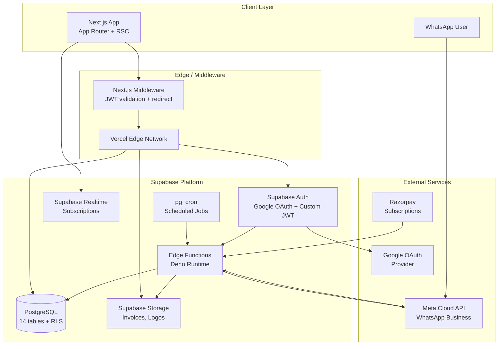
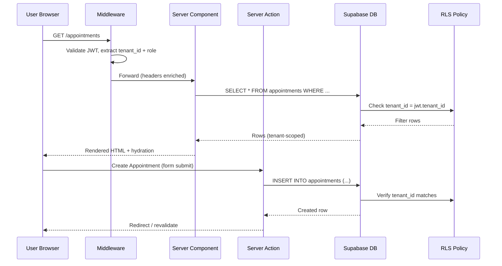
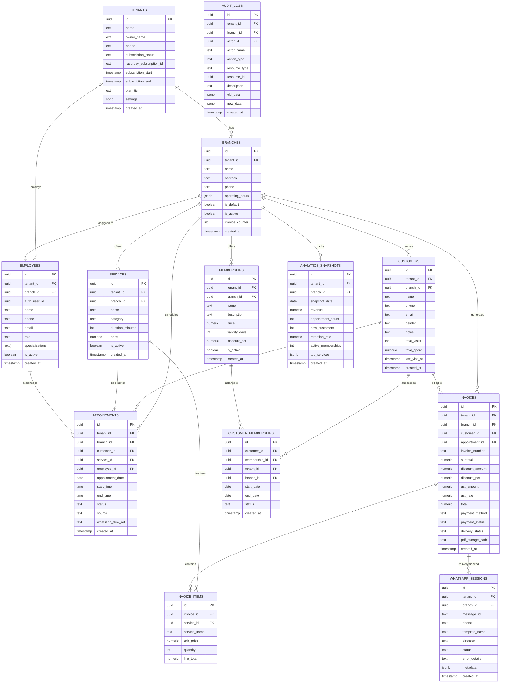
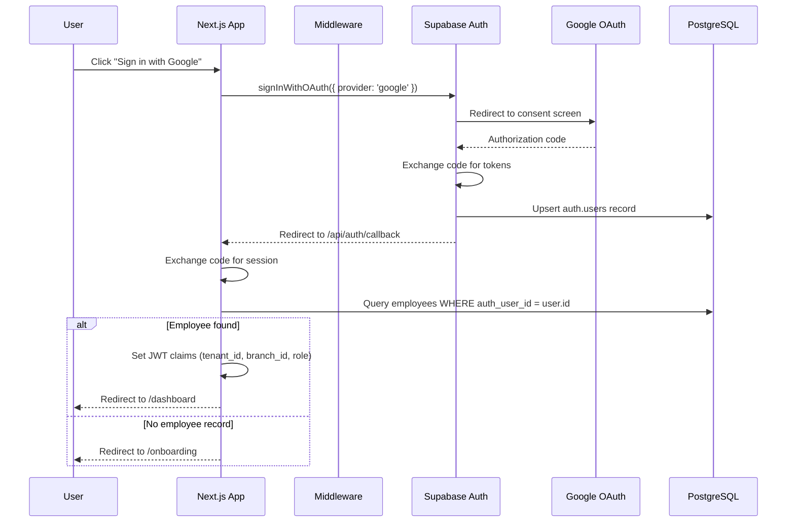
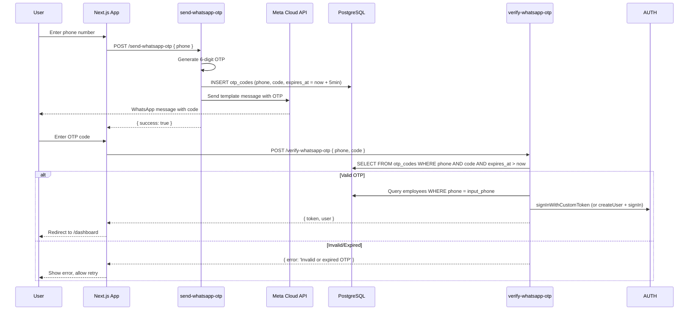
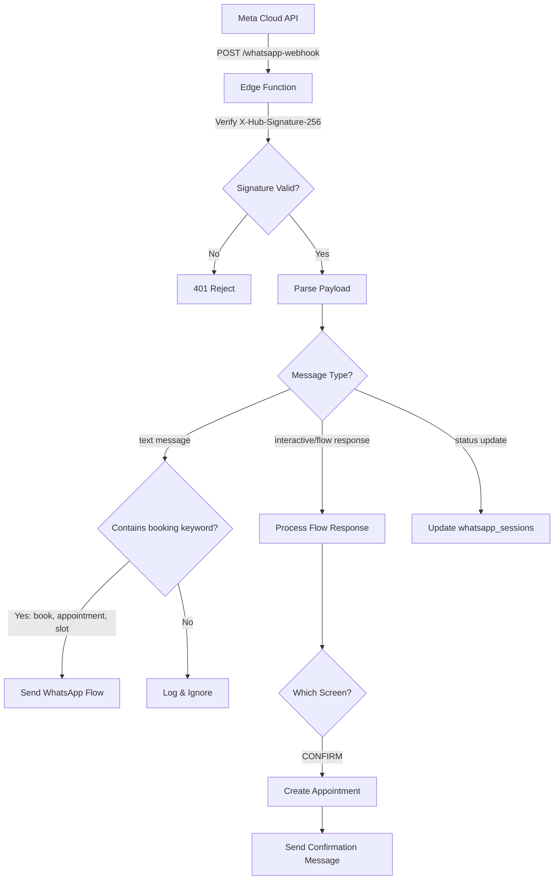
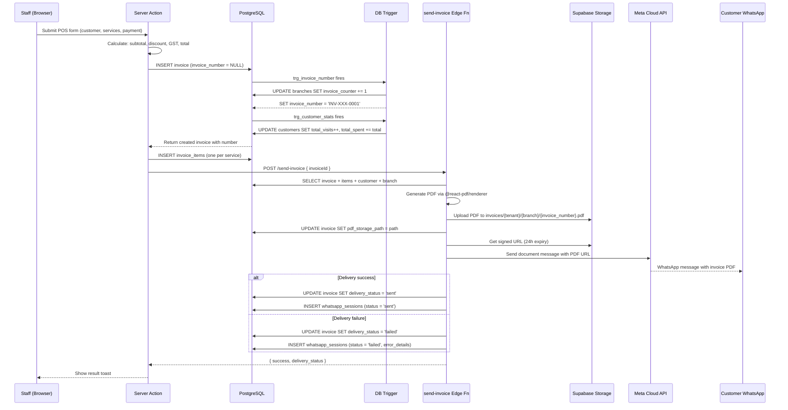
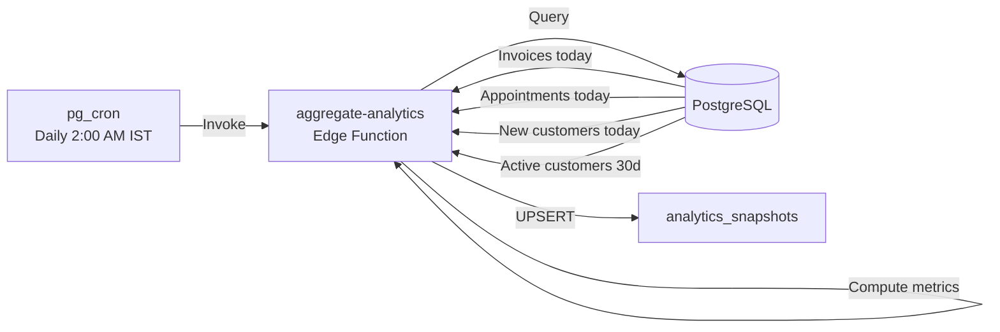

# Design Document: Snip & Glow — WhatsApp-Native Salon Management SaaS

## Overview

Snip & Glow is a multi-tenant salon management SaaS platform built on Next.js 14 (App Router) with Supabase as the backend. It adapts the existing PingFlow gym CRM architecture from Firebase/Vite/React to a modern Supabase/Next.js stack while retaining WhatsApp-native interactions via Meta Cloud API.

The system serves Indian salon businesses with:
- A responsive web dashboard for staff (appointments, billing, customers, analytics)
- WhatsApp Flows for customer-facing appointment booking (no app download)
- Automated messaging pipelines (reminders, follow-ups, invoice delivery)
- Multi-tenant data isolation via PostgreSQL Row-Level Security (RLS)
- India-specific localization (INR, IST, +91 phones, UPI, GST)

### Key Design Decisions

| Decision | Rationale |
|----------|-----------|
| Supabase over Firebase | PostgreSQL enables RLS for tenant isolation, triggers for auto-computed fields, and pg_cron for scheduled jobs — all at the DB level |
| Next.js App Router | Server Components reduce client bundle, Server Actions simplify mutations, middleware handles auth/redirect |
| Supabase Edge Functions (Deno) | Webhook handlers and background jobs run independently of the frontend; Deno provides fast cold starts |
| @react-pdf/renderer on Edge | Server-side PDF generation avoids client-side popups and enables direct Storage upload |
| WhatsApp Flows over chatbot | Native multi-screen UI inside WhatsApp provides a superior booking UX vs. text-based conversation |
| Recharts for analytics | Lightweight, composable, React-native charting — already familiar from PingFlow patterns |
| shadcn/ui + Tailwind | Accessible, customizable component primitives; consistent with existing PingFlow design language |

---

## Architecture

### System Architecture Diagram



### Next.js App Router Structure

```
app/
├── (auth)/
│   ├── login/page.tsx              # Google OAuth + WhatsApp OTP
│   ├── verify-otp/page.tsx         # OTP verification screen
│   └── layout.tsx                  # Auth layout (no sidebar)
├── (dashboard)/
│   ├── layout.tsx                  # AppShell: sidebar + topbar + branch switcher
│   ├── page.tsx                    # Dashboard home (redirect)
│   ├── appointments/
│   │   ├── page.tsx                # Calendar + list view
│   │   └── [id]/page.tsx           # Appointment detail
│   ├── customers/
│   │   ├── page.tsx                # Customer list + search
│   │   └── [id]/page.tsx           # Customer profile + history
│   ├── billing/
│   │   ├── page.tsx                # Invoice list
│   │   └── new/page.tsx            # POS billing screen
│   ├── services/page.tsx           # Service catalog management
│   ├── memberships/page.tsx        # Membership plans
│   ├── staff/page.tsx              # Employee management (owner only)
│   ├── branches/page.tsx           # Branch management (owner only)
│   ├── analytics/page.tsx          # Charts + metrics
│   ├── audit-log/page.tsx          # Activity trail
│   ├── settings/page.tsx           # Tenant settings + subscription
│   └── onboarding/page.tsx         # First-time setup wizard
├── api/
│   ├── auth/
│   │   └── callback/route.ts       # OAuth callback handler
│   └── webhooks/
│       └── razorpay/route.ts       # Razorpay webhook (if not Edge Fn)
├── layout.tsx                      # Root layout: providers, fonts
├── middleware.ts                   # JWT validation, role injection, redirects
└── globals.css                     # Tailwind base + custom tokens
```

### Request Flow



---

## Components and Interfaces

### Core UI Components (shadcn/ui based)

| Component | Purpose | Props |
|-----------|---------|-------|
| `AppShell` | Dashboard layout with sidebar, topbar, branch switcher | `children` |
| `Sidebar` | Permission-filtered navigation | Uses `useRole()` hook |
| `BranchSwitcher` | Dropdown to switch active branch context | `branches`, `activeBranchId` |
| `DataTable` | Sortable, filterable table with pagination | `columns`, `data`, `searchKey` |
| `CalendarView` | Day/week appointment calendar | `appointments`, `onSlotClick` |
| `POSBilling` | Multi-item billing form with discount calc | `customer`, `services`, `membership` |
| `InvoicePreview` | PDF-style invoice preview before send | `invoice`, `settings` |
| `ServiceCard` | Service display with category badge | `service` |
| `CustomerProfile` | Profile header + visit/billing tabs | `customer` |
| `MembershipBadge` | Active membership indicator | `membership` |
| `WhatsAppFlowStatus` | Message delivery status indicator | `session` |
| `AnalyticsChart` | Recharts wrapper with date range filter | `data`, `type`, `dateRange` |
| `OnboardingWizard` | Multi-step form with progress | `step`, `onComplete` |
| `RoleGuard` | Conditional render based on role | `allowed: Role[]`, `children` |
| `PlanGuard` | Feature gating by subscription tier | `feature`, `children` |
| `Toast` | Notification system | `message`, `type` |
| `ConfirmDialog` | Destructive action confirmation | `title`, `onConfirm` |
| `LoadingSkeleton` | Async data placeholder | `variant` |
| `ErrorBoundary` | Graceful error recovery | `fallback` |

### Server Actions Interface

```typescript
// app/(dashboard)/appointments/actions.ts
'use server'

export async function createAppointment(data: CreateAppointmentInput): Promise<ActionResult<Appointment>>
export async function updateAppointmentStatus(id: string, status: AppointmentStatus): Promise<ActionResult<void>>
export async function getAvailableSlots(employeeId: string, date: string, serviceDuration: number): Promise<TimeSlot[]>

// app/(dashboard)/billing/actions.ts
'use server'

export async function createInvoice(data: CreateInvoiceInput): Promise<ActionResult<Invoice>>
export async function sendInvoiceWhatsApp(invoiceId: string): Promise<ActionResult<void>>
export async function retryInvoiceDelivery(invoiceId: string): Promise<ActionResult<void>>

// app/(dashboard)/customers/actions.ts
'use server'

export async function createCustomer(data: CreateCustomerInput): Promise<ActionResult<Customer>>
export async function searchCustomers(query: string): Promise<Customer[]>
export async function assignMembership(customerId: string, membershipId: string): Promise<ActionResult<void>>
```

### Edge Function Endpoints

| Function | Trigger | Purpose |
|----------|---------|---------|
| `whatsapp-webhook` | HTTP POST (Meta) | Validate signature, route incoming messages/statuses |
| `whatsapp-flow-endpoint` | HTTP POST (Meta) | Return dynamic data for WhatsApp Flow screens |
| `send-whatsapp-otp` | HTTP POST | Generate OTP, send via WhatsApp, store with TTL |
| `verify-whatsapp-otp` | HTTP POST | Validate OTP, issue Supabase auth token |
| `send-invoice` | HTTP POST (internal) | Generate PDF → Storage → WhatsApp delivery |
| `appointment-reminders` | pg_cron (daily 8am IST) | Query next-day appointments, send reminders |
| `follow-up-trigger` | pg_cron (daily 10am IST) | Query inactive customers (30+ days), send follow-ups |
| `aggregate-analytics` | pg_cron (daily 2am IST) | Compute daily snapshots per branch |
| `razorpay-webhook` | HTTP POST (Razorpay) | Validate signature, update subscription status |

---

## Data Models

### Entity Relationship Diagram



### PostgreSQL Schema (Key Tables)

```sql
-- Tenants (top-level isolation boundary)
CREATE TABLE tenants (
    id UUID PRIMARY KEY DEFAULT gen_random_uuid(),
    name TEXT NOT NULL,
    owner_name TEXT NOT NULL,
    phone TEXT NOT NULL,
    subscription_status TEXT NOT NULL DEFAULT 'trial'
        CHECK (subscription_status IN ('trial','active','past_due','expired','cancelled')),
    razorpay_subscription_id TEXT,
    razorpay_customer_id TEXT,
    subscription_start TIMESTAMPTZ DEFAULT now(),
    subscription_end TIMESTAMPTZ DEFAULT (now() + INTERVAL '14 days'),
    plan_tier TEXT NOT NULL DEFAULT 'starter'
        CHECK (plan_tier IN ('starter','pro','enterprise')),
    settings JSONB DEFAULT '{}',
    created_at TIMESTAMPTZ DEFAULT now()
);

-- Branches
CREATE TABLE branches (
    id UUID PRIMARY KEY DEFAULT gen_random_uuid(),
    tenant_id UUID NOT NULL REFERENCES tenants(id) ON DELETE CASCADE,
    name TEXT NOT NULL,
    address TEXT,
    phone TEXT,
    operating_hours JSONB DEFAULT '{"mon":{"open":"09:00","close":"21:00"},"tue":{"open":"09:00","close":"21:00"},"wed":{"open":"09:00","close":"21:00"},"thu":{"open":"09:00","close":"21:00"},"fri":{"open":"09:00","close":"21:00"},"sat":{"open":"09:00","close":"21:00"},"sun":{"open":"10:00","close":"18:00"}}',
    is_default BOOLEAN DEFAULT false,
    is_active BOOLEAN DEFAULT true,
    invoice_counter INT DEFAULT 0,
    created_at TIMESTAMPTZ DEFAULT now()
);

-- Appointments
CREATE TABLE appointments (
    id UUID PRIMARY KEY DEFAULT gen_random_uuid(),
    tenant_id UUID NOT NULL REFERENCES tenants(id),
    branch_id UUID NOT NULL REFERENCES branches(id),
    customer_id UUID NOT NULL REFERENCES customers(id),
    service_id UUID NOT NULL REFERENCES services(id),
    employee_id UUID NOT NULL REFERENCES employees(id),
    appointment_date DATE NOT NULL,
    start_time TIME NOT NULL,
    end_time TIME NOT NULL,
    status TEXT NOT NULL DEFAULT 'booked'
        CHECK (status IN ('booked','confirmed','completed','cancelled')),
    source TEXT DEFAULT 'dashboard'
        CHECK (source IN ('dashboard','whatsapp_flow')),
    whatsapp_flow_ref TEXT,
    created_at TIMESTAMPTZ DEFAULT now(),
    -- Prevent overlapping appointments for the same employee
    CONSTRAINT no_overlap EXCLUDE USING gist (
        employee_id WITH =,
        appointment_date WITH =,
        tsrange(
            (appointment_date + start_time)::timestamp,
            (appointment_date + end_time)::timestamp
        ) WITH &&
    ) WHERE (status != 'cancelled')
);

-- Invoices with auto-incrementing number per branch
CREATE TABLE invoices (
    id UUID PRIMARY KEY DEFAULT gen_random_uuid(),
    tenant_id UUID NOT NULL REFERENCES tenants(id),
    branch_id UUID NOT NULL REFERENCES branches(id),
    customer_id UUID NOT NULL REFERENCES customers(id),
    appointment_id UUID REFERENCES appointments(id),
    invoice_number TEXT NOT NULL,
    subtotal NUMERIC(10,2) NOT NULL DEFAULT 0,
    discount_amount NUMERIC(10,2) DEFAULT 0,
    discount_pct NUMERIC(5,2) DEFAULT 0,
    gst_amount NUMERIC(10,2) DEFAULT 0,
    gst_rate NUMERIC(5,2) DEFAULT 0,
    total NUMERIC(10,2) NOT NULL DEFAULT 0,
    payment_method TEXT NOT NULL CHECK (payment_method IN ('cash','upi','card')),
    payment_status TEXT NOT NULL DEFAULT 'paid'
        CHECK (payment_status IN ('paid','partial','pending')),
    delivery_status TEXT DEFAULT 'pending'
        CHECK (delivery_status IN ('pending','sent','delivered','read','failed')),
    pdf_storage_path TEXT,
    created_at TIMESTAMPTZ DEFAULT now(),
    UNIQUE(branch_id, invoice_number)
);
```

### Key Database Triggers

```sql
-- Auto-increment invoice number per branch
CREATE OR REPLACE FUNCTION generate_invoice_number()
RETURNS TRIGGER AS $$
DECLARE
    branch_prefix TEXT;
    next_counter INT;
BEGIN
    -- Atomically increment the branch counter
    UPDATE branches
    SET invoice_counter = invoice_counter + 1
    WHERE id = NEW.branch_id
    RETURNING invoice_counter INTO next_counter;

    -- Get branch name abbreviation (first 3 chars uppercase)
    SELECT UPPER(LEFT(name, 3)) INTO branch_prefix
    FROM branches WHERE id = NEW.branch_id;

    NEW.invoice_number := 'INV-' || branch_prefix || '-' || LPAD(next_counter::TEXT, 4, '0');
    RETURN NEW;
END;
$$ LANGUAGE plpgsql;

CREATE TRIGGER trg_invoice_number
    BEFORE INSERT ON invoices
    FOR EACH ROW
    WHEN (NEW.invoice_number IS NULL OR NEW.invoice_number = '')
    EXECUTE FUNCTION generate_invoice_number();

-- Auto-update customer stats on invoice creation
CREATE OR REPLACE FUNCTION update_customer_stats()
RETURNS TRIGGER AS $$
BEGIN
    UPDATE customers
    SET
        total_visits = total_visits + 1,
        total_spent = total_spent + NEW.total,
        last_visit_at = NEW.created_at
    WHERE id = NEW.customer_id;
    RETURN NEW;
END;
$$ LANGUAGE plpgsql;

CREATE TRIGGER trg_customer_stats
    AFTER INSERT ON invoices
    FOR EACH ROW
    EXECUTE FUNCTION update_customer_stats();

-- Automatic audit logging
CREATE OR REPLACE FUNCTION audit_log_trigger()
RETURNS TRIGGER AS $$
BEGIN
    INSERT INTO audit_logs (tenant_id, branch_id, actor_id, actor_name, action_type, resource_type, resource_id, description, old_data, new_data)
    VALUES (
        COALESCE(NEW.tenant_id, OLD.tenant_id),
        COALESCE(NEW.branch_id, OLD.branch_id),
        auth.uid(),
        current_setting('app.actor_name', true),
        TG_OP,
        TG_TABLE_NAME,
        COALESCE(NEW.id, OLD.id),
        TG_OP || ' on ' || TG_TABLE_NAME,
        CASE WHEN TG_OP IN ('UPDATE','DELETE') THEN to_jsonb(OLD) ELSE NULL END,
        CASE WHEN TG_OP IN ('INSERT','UPDATE') THEN to_jsonb(NEW) ELSE NULL END
    );
    RETURN COALESCE(NEW, OLD);
END;
$$ LANGUAGE plpgsql SECURITY DEFINER;
```

### RLS Policies (Tenant Isolation)

```sql
-- Enable RLS on all tables
ALTER TABLE customers ENABLE ROW LEVEL SECURITY;
ALTER TABLE appointments ENABLE ROW LEVEL SECURITY;
ALTER TABLE invoices ENABLE ROW LEVEL SECURITY;
-- ... (all 14 tables)

-- Base tenant isolation policy (applied to all tables)
CREATE POLICY tenant_isolation ON customers
    USING (tenant_id = (auth.jwt() ->> 'tenant_id')::uuid);

-- Role-based access: staff can only read
CREATE POLICY staff_read_only ON customers
    FOR SELECT
    USING (
        tenant_id = (auth.jwt() ->> 'tenant_id')::uuid
        AND (auth.jwt() ->> 'role') = 'staff'
    );

CREATE POLICY staff_no_write ON customers
    FOR INSERT
    WITH CHECK (
        tenant_id = (auth.jwt() ->> 'tenant_id')::uuid
        AND (auth.jwt() ->> 'role') IN ('owner', 'manager')
    );

-- Branch-scoped access for non-owner roles
CREATE POLICY branch_scope ON customers
    USING (
        tenant_id = (auth.jwt() ->> 'tenant_id')::uuid
        AND (
            (auth.jwt() ->> 'role') = 'owner'
            OR branch_id = (auth.jwt() ->> 'branch_id')::uuid
        )
    );
```

### Slot Availability Calculation

The most complex query in the system — computing available time slots for a given employee on a given date:

```sql
-- Function: get_available_slots(employee_id, date, service_duration_minutes)
CREATE OR REPLACE FUNCTION get_available_slots(
    p_employee_id UUID,
    p_date DATE,
    p_duration INT
)
RETURNS TABLE(slot_start TIME, slot_end TIME) AS $$
DECLARE
    v_branch_id UUID;
    v_day_name TEXT;
    v_open_time TIME;
    v_close_time TIME;
    v_slot_interval INTERVAL;
BEGIN
    -- Get employee's branch and operating hours
    SELECT e.branch_id INTO v_branch_id
    FROM employees e WHERE e.id = p_employee_id;

    v_day_name := LOWER(to_char(p_date, 'Dy'));

    SELECT
        (operating_hours -> v_day_name ->> 'open')::TIME,
        (operating_hours -> v_day_name ->> 'close')::TIME
    INTO v_open_time, v_close_time
    FROM branches WHERE id = v_branch_id;

    -- If branch is closed on this day
    IF v_open_time IS NULL THEN RETURN; END IF;

    v_slot_interval := (p_duration || ' minutes')::INTERVAL;

    -- Generate all possible slots, excluding booked ones
    RETURN QUERY
    SELECT gs.slot AS slot_start, (gs.slot + v_slot_interval)::TIME AS slot_end
    FROM generate_series(v_open_time, v_close_time - v_slot_interval, INTERVAL '30 minutes') AS gs(slot)
    WHERE NOT EXISTS (
        SELECT 1 FROM appointments a
        WHERE a.employee_id = p_employee_id
          AND a.appointment_date = p_date
          AND a.status != 'cancelled'
          AND tsrange(
              (p_date + gs.slot)::timestamp,
              (p_date + gs.slot + v_slot_interval)::timestamp
          ) && tsrange(
              (p_date + a.start_time)::timestamp,
              (p_date + a.end_time)::timestamp
          )
    );
END;
$$ LANGUAGE plpgsql SECURITY DEFINER;
```

---

## Authentication Flow

### Google OAuth Flow



### WhatsApp OTP Flow



### Middleware JWT Validation

```typescript
// middleware.ts
import { createMiddlewareClient } from '@supabase/auth-helpers-nextjs'
import { NextResponse } from 'next/server'
import type { NextRequest } from 'next/server'

export async function middleware(req: NextRequest) {
  const res = NextResponse.next()
  const supabase = createMiddlewareClient({ req, res })

  const { data: { session } } = await supabase.auth.getSession()

  // Unauthenticated → login
  if (!session && req.nextUrl.pathname.startsWith('/(dashboard)')) {
    return NextResponse.redirect(new URL('/login', req.url))
  }

  // Authenticated but no tenant → onboarding
  if (session && !session.user.user_metadata?.tenant_id) {
    if (!req.nextUrl.pathname.includes('/onboarding')) {
      return NextResponse.redirect(new URL('/onboarding', req.url))
    }
  }

  // Inject role/tenant into headers for Server Components
  if (session) {
    res.headers.set('x-tenant-id', session.user.user_metadata?.tenant_id || '')
    res.headers.set('x-branch-id', session.user.user_metadata?.branch_id || '')
    res.headers.set('x-user-role', session.user.user_metadata?.role || 'staff')
  }

  return res
}

export const config = {
  matcher: ['/(dashboard)/:path*', '/onboarding']
}
```

---

## WhatsApp Integration Architecture

### Webhook Routing



### WhatsApp Flow Data Exchange

The WhatsApp Flow endpoint handles the 5-screen booking flow. Meta sends a POST request for each screen transition with encrypted data.

```typescript
// supabase/functions/whatsapp-flow-endpoint/index.ts

interface FlowRequest {
  version: string
  action: 'ping' | 'INIT' | 'data_exchange'
  screen: string
  data: Record<string, unknown>
  flow_token: string
}

interface FlowResponse {
  version: string
  screen: string
  data: Record<string, unknown>
}

// Screen flow: SELECT_SERVICE → SELECT_STYLIST → SELECT_DATE → SELECT_TIME → CONFIRM

async function handleDataExchange(req: FlowRequest, tenantId: string, branchId: string): Promise<FlowResponse> {
  switch (req.screen) {
    case 'SELECT_SERVICE':
      // Return active services grouped by category
      const services = await getActiveServices(tenantId, branchId)
      return {
        version: req.version,
        screen: 'SELECT_SERVICE',
        data: {
          services: services.map(s => ({
            id: s.id,
            title: s.name,
            description: `${s.duration_minutes} min • ₹${s.price}`,
            category: s.category
          }))
        }
      }

    case 'SELECT_STYLIST':
      // Return available employees for selected service
      const serviceId = req.data.service_id as string
      const employees = await getAvailableEmployees(tenantId, branchId, serviceId)
      return {
        version: req.version,
        screen: 'SELECT_STYLIST',
        data: {
          stylists: employees.map(e => ({
            id: e.id,
            title: e.name,
            description: e.specializations?.join(', ') || 'All services'
          }))
        }
      }

    case 'SELECT_DATE':
      // Return next 14 days (excluding days branch is closed)
      const dates = await getAvailableDates(tenantId, branchId, 14)
      return {
        version: req.version,
        screen: 'SELECT_DATE',
        data: { dates }
      }

    case 'SELECT_TIME':
      // Return available slots for employee on selected date
      const { employee_id, date, service_id: svcId } = req.data as {
        employee_id: string; date: string; service_id: string
      }
      const service = await getService(svcId)
      const slots = await getAvailableSlots(employee_id, date, service.duration_minutes)
      return {
        version: req.version,
        screen: 'SELECT_TIME',
        data: {
          slots: slots.map(s => ({
            id: `${s.slot_start}`,
            title: formatTimeIST(s.slot_start)
          }))
        }
      }

    case 'CONFIRM':
      // Create appointment and return confirmation
      const appointment = await createAppointmentFromFlow(req.data, tenantId, branchId)
      return {
        version: req.version,
        screen: 'SUCCESS',
        data: {
          message: `✅ Appointment confirmed!\n📅 ${appointment.date}\n⏰ ${appointment.time}\n💇 ${appointment.service}\n👤 ${appointment.stylist}`
        }
      }

    default:
      throw new Error(`Unknown screen: ${req.screen}`)
  }
}
```

### WhatsApp Flow Encryption/Decryption

Meta encrypts flow data exchange payloads using AES-GCM. The Edge Function must decrypt incoming requests and encrypt responses:

```typescript
// Decrypt incoming flow request
async function decryptFlowRequest(encryptedBody: string, privateKey: CryptoKey): Promise<FlowRequest> {
  const { encrypted_aes_key, encrypted_flow_data, initial_vector } = JSON.parse(encryptedBody)

  // Decrypt AES key using RSA-OAEP private key
  const aesKeyBuffer = await crypto.subtle.decrypt(
    { name: 'RSA-OAEP' },
    privateKey,
    base64ToBuffer(encrypted_aes_key)
  )

  // Decrypt flow data using AES-128-GCM
  const aesKey = await crypto.subtle.importKey('raw', aesKeyBuffer, 'AES-GCM', false, ['decrypt'])
  const decrypted = await crypto.subtle.decrypt(
    { name: 'AES-GCM', iv: base64ToBuffer(initial_vector) },
    aesKey,
    base64ToBuffer(encrypted_flow_data)
  )

  return JSON.parse(new TextDecoder().decode(decrypted))
}

// Encrypt outgoing flow response
async function encryptFlowResponse(response: FlowResponse, aesKey: CryptoKey, iv: Uint8Array): Promise<string> {
  const plaintext = new TextEncoder().encode(JSON.stringify(response))
  const encrypted = await crypto.subtle.encrypt(
    { name: 'AES-GCM', iv },
    aesKey,
    plaintext
  )
  return bufferToBase64(encrypted)
}
```

---

## Billing / Invoice Pipeline

### POS → Invoice → PDF → WhatsApp Flow



### Billing Calculation Logic

```typescript
interface BillingCalculation {
  lineItems: { serviceId: string; name: string; price: number; quantity: number }[]
  membershipDiscountPct: number  // 0-100
  gstRate: number               // 0-100 (typically 18)
}

function calculateInvoiceTotal(input: BillingCalculation): {
  subtotal: number
  discountAmount: number
  taxableAmount: number
  gstAmount: number
  total: number
} {
  const subtotal = input.lineItems.reduce((sum, item) => sum + (item.price * item.quantity), 0)
  const discountAmount = Math.round(subtotal * input.membershipDiscountPct / 100)
  const taxableAmount = subtotal - discountAmount
  const gstAmount = Math.round(taxableAmount * input.gstRate / 100)
  const total = taxableAmount + gstAmount

  return { subtotal, discountAmount, taxableAmount, gstAmount, total }
}
```

---

## Analytics Aggregation Pipeline

### Nightly Snapshot Computation



### Aggregation Queries

```sql
-- Revenue for a given date and branch
SELECT COALESCE(SUM(total), 0) AS revenue
FROM invoices
WHERE branch_id = $1 AND DATE(created_at AT TIME ZONE 'Asia/Kolkata') = $2;

-- Appointment count
SELECT COUNT(*) AS appointment_count
FROM appointments
WHERE branch_id = $1 AND appointment_date = $2 AND status != 'cancelled';

-- New customers
SELECT COUNT(*) AS new_customers
FROM customers
WHERE branch_id = $1 AND DATE(created_at AT TIME ZONE 'Asia/Kolkata') = $2;

-- Retention rate (customers with 2+ visits in last 30 days / total active)
WITH active_customers AS (
    SELECT id FROM customers
    WHERE branch_id = $1 AND last_visit_at >= (now() - INTERVAL '90 days')
),
repeat_visitors AS (
    SELECT customer_id
    FROM appointments
    WHERE branch_id = $1
      AND appointment_date >= (CURRENT_DATE - 30)
      AND status = 'completed'
    GROUP BY customer_id
    HAVING COUNT(*) >= 2
)
SELECT
    CASE WHEN (SELECT COUNT(*) FROM active_customers) = 0 THEN 0
    ELSE ROUND(
        (SELECT COUNT(*) FROM repeat_visitors)::NUMERIC /
        (SELECT COUNT(*) FROM active_customers) * 100, 2
    ) END AS retention_rate;

-- Top services by revenue (last 30 days)
SELECT
    s.name,
    s.category,
    SUM(ii.line_total) AS total_revenue,
    COUNT(*) AS times_booked
FROM invoice_items ii
JOIN services s ON s.id = ii.service_id
JOIN invoices i ON i.id = ii.invoice_id
WHERE i.branch_id = $1
  AND i.created_at >= (now() - INTERVAL '30 days')
GROUP BY s.id, s.name, s.category
ORDER BY total_revenue DESC
LIMIT 10;
```

---

## Multi-Tenant Data Isolation Strategy

### Isolation Layers

| Layer | Mechanism | Enforcement |
|-------|-----------|-------------|
| Database | RLS policies on all tables | `tenant_id = jwt.tenant_id` |
| API | Server Actions extract tenant from session | No raw tenant_id in client requests |
| Middleware | JWT validation + claim injection | Headers set before Server Components |
| Edge Functions | Verify tenant from webhook context or auth header | Explicit tenant resolution |
| Storage | Bucket paths: `{tenant_id}/{branch_id}/...` | Storage policies mirror RLS |
| Realtime | Channel subscriptions filtered by RLS | Automatic via Supabase |

### JWT Claims Structure

```json
{
  "sub": "auth-user-uuid",
  "tenant_id": "tenant-uuid",
  "branch_id": "branch-uuid",
  "role": "owner|manager|staff",
  "email": "user@example.com",
  "iat": 1714400000,
  "exp": 1714486400
}
```

### Branch Switching (Owner)

When an owner switches branches, the system updates the active `branch_id` in the session metadata. All subsequent queries use the new branch context:

```typescript
// Server Action: switchBranch
'use server'
export async function switchBranch(branchId: string) {
  const supabase = createServerClient()
  const { data: { user } } = await supabase.auth.getUser()

  // Verify branch belongs to user's tenant
  const { data: branch } = await supabase
    .from('branches')
    .select('id')
    .eq('id', branchId)
    .eq('tenant_id', user.user_metadata.tenant_id)
    .single()

  if (!branch) throw new Error('Branch not found')

  // Update user metadata (reflected in next JWT refresh)
  await supabase.auth.updateUser({
    data: { branch_id: branchId }
  })

  revalidatePath('/')
}
```

---

## Correctness Properties

*A property is a characteristic or behavior that should hold true across all valid executions of a system — essentially, a formal statement about what the system should do. Properties serve as the bridge between human-readable specifications and machine-verifiable correctness guarantees.*

### Property 1: Role Permission Enforcement

*For any* combination of user role (owner, manager, staff), resource, and action, the permission resolver SHALL return `true` only when the role-resource-action triple is explicitly allowed in the permission map, and `false` otherwise.

**Validates: Requirements 2.5, 2.6, 2.7, 10.7, 12.6**

### Property 2: INR Currency Formatting

*For any* non-negative number, the `formatINR` function SHALL produce a string that starts with "₹", uses the Indian grouping system (first group of 3 from the right, then groups of 2), and contains no decimal places for whole numbers.

**Validates: Requirements 3.5, 15.1**

### Property 3: Indian Phone Number Validation and Formatting

*For any* 10-digit string where the first digit is in [6-9], `isValidIndianPhone` SHALL return `true` and `formatPhoneE164` SHALL produce a string matching the pattern `+91XXXXXXXXXX`. For any string that does not match this pattern, validation SHALL return `false`.

**Validates: Requirements 7.5, 15.3**

### Property 4: Date and Time Formatting (IST)

*For any* valid Date object, the date formatter SHALL produce a string matching the pattern `DD MMM YYYY` (e.g., "29 Apr 2026") and the time formatter SHALL produce a 12-hour format string with AM/PM in IST timezone.

**Validates: Requirements 4.7, 15.2**

### Property 5: Billing Calculation Correctness

*For any* list of service line items (each with price > 0 and quantity >= 1), any discount percentage in [0, 100], and any GST rate in [0, 100], the billing calculation SHALL satisfy: `subtotal = Σ(price × quantity)`, `discountAmount = round(subtotal × discountPct / 100)`, `gstAmount = round((subtotal - discountAmount) × gstRate / 100)`, and `total = subtotal - discountAmount + gstAmount`.

**Validates: Requirements 6.2, 8.3, 15.5**

### Property 6: Invoice Number Sequential Increment Per Branch

*For any* branch, consecutive invoice creations SHALL produce invoice numbers where the numeric suffix increments by exactly 1, and the format matches `INV-{BRANCH_PREFIX}-{NNNN}` where NNNN is zero-padded to 4 digits.

**Validates: Requirements 6.4, 17.3**

### Property 7: Appointment Slot Availability (No Overlaps)

*For any* employee, date, and set of existing non-cancelled appointments, the `get_available_slots` function SHALL return only time slots where the proposed appointment (start_time to start_time + duration) does not overlap with any existing appointment's time range, and all returned slots fall within the branch's operating hours for that day.

**Validates: Requirements 4.3, 5.5**

### Property 8: Appointment Status Machine Transitions

*For any* appointment in state S, a transition to state T SHALL succeed only if (S, T) is in the set {(booked, confirmed), (booked, cancelled), (confirmed, completed), (confirmed, cancelled)}, and SHALL be rejected for all other (S, T) pairs.

**Validates: Requirements 4.5**

### Property 9: Soft-Delete Exclusion from Active Queries

*For any* service (or other soft-deletable entity) where `is_active = false`, querying for active records SHALL never include that entity in the result set. Conversely, any entity with `is_active = true` SHALL appear in active queries (assuming tenant/branch scope matches).

**Validates: Requirements 3.4, 5.3**

### Property 10: Customer Stats Invariant

*For any* customer, after any sequence of invoice creations, `total_visits` SHALL equal the count of invoices for that customer, and `total_spent` SHALL equal the sum of all invoice totals for that customer.

**Validates: Requirements 7.4, 17.4**

### Property 11: Database Round-Trip Preservation

*For any* valid data object (Customer, Service, Appointment, Invoice, Membership), inserting the object into the database and then reading it back SHALL produce an object equivalent to the original (accounting for server-generated fields like `id` and `created_at`).

**Validates: Requirements 17.7**

### Property 12: Webhook HMAC Signature Validation

*For any* request body and secret key pair, the signature verification function SHALL return `true` only when the provided signature equals `sha256=HMAC-SHA256(body, secret)`. For any modified body or incorrect secret, verification SHALL return `false`.

**Validates: Requirements 18.1, 18.9**

### Property 13: Audit Log Completeness

*For any* INSERT, UPDATE, or DELETE operation on a core table (customers, appointments, invoices, services, memberships, employees), the audit trigger SHALL create exactly one audit_log record containing non-null values for: tenant_id, action_type, resource_type, resource_id, and created_at.

**Validates: Requirements 12.1, 12.2, 17.5**

### Property 14: Analytics Snapshot Aggregation

*For any* branch and date, the computed analytics snapshot SHALL satisfy: `revenue = SUM(invoices.total)` for that date, `appointment_count = COUNT(non-cancelled appointments)` for that date, and `new_customers = COUNT(customers created)` on that date.

**Validates: Requirements 18.8, 10.3**

### Property 15: Membership Expiry and Reminder List

*For any* set of customer_memberships, the expiry check SHALL mark as "expired" exactly those where `end_date < current_date` and status was "active". The 7-day reminder list SHALL contain exactly those memberships where `0 <= end_date - current_date <= 7` and status = "active".

**Validates: Requirements 8.4, 8.6**

---

## Error Handling

### Error Handling Strategy

| Layer | Strategy | User Experience |
|-------|----------|----------------|
| Server Actions | Try/catch with typed `ActionResult<T>` | Toast notification with friendly message |
| Edge Functions | Try/catch, always return 200 to webhooks | Log errors, retry mechanisms |
| Database | Constraint violations caught by Supabase client | Form validation errors shown inline |
| Middleware | Redirect on auth failure | Redirect to login page |
| Client Components | Error Boundaries per route segment | "Something went wrong" + Try Again button |
| WhatsApp Flow | Fallback text message on any error | "Please try again or call the salon" |
| PDF Generation | Catch rendering errors | Toast: "Invoice generation failed, please retry" |
| Payment Webhooks | Idempotent processing, log duplicates | No user-facing error (background) |

### ActionResult Pattern

```typescript
type ActionResult<T> =
  | { success: true; data: T }
  | { success: false; error: string; code?: string }

// Usage in Server Actions
export async function createAppointment(input: CreateAppointmentInput): Promise<ActionResult<Appointment>> {
  try {
    // Validate slot availability
    const available = await checkSlotAvailability(input.employeeId, input.date, input.startTime, input.duration)
    if (!available) {
      return { success: false, error: 'This time slot is no longer available. Please select another.' }
    }

    const appointment = await db.from('appointments').insert(input).select().single()
    return { success: true, data: appointment.data }
  } catch (error) {
    console.error('createAppointment failed:', error)
    return { success: false, error: 'Failed to create appointment. Please try again.' }
  }
}
```

### Edge Function Error Handling

```typescript
// Always respond 200 to webhook providers to prevent retries
Deno.serve(async (req) => {
  try {
    const result = await handleWebhook(req)
    return new Response(JSON.stringify(result), { status: 200 })
  } catch (error) {
    // Log for debugging but don't expose to caller
    console.error('[whatsapp-webhook] Error:', error)
    // Still return 200 to prevent Meta from retrying
    return new Response('', { status: 200 })
  }
})
```

### WhatsApp Flow Error Fallback

```typescript
async function handleFlowError(phone: string, tenantId: string, error: Error) {
  console.error(`[whatsapp-flow] Error for ${phone}:`, error)

  // Send fallback text message
  await sendWhatsAppMessage(tenantId, phone, 'booking_error_fallback', [])

  // Log the failure
  await db.from('whatsapp_sessions').insert({
    tenant_id: tenantId,
    phone,
    direction: 'outbound',
    status: 'failed',
    error_details: error.message,
    metadata: { context: 'flow_error_fallback' }
  })
}
```

### Subscription Expiry Handling

```typescript
// Middleware check for expired subscriptions
function checkSubscriptionAccess(tenant: Tenant, method: string): boolean {
  if (tenant.subscription_status === 'expired') {
    const expiredDays = differenceInDays(new Date(), new Date(tenant.subscription_end))
    if (expiredDays > 7) {
      // Read-only mode: only allow GET-like operations
      return method === 'GET' || method === 'HEAD'
    }
  }
  return true // Active or within grace period
}
```

---

## Testing Strategy

### Testing Framework

| Layer | Framework | Purpose |
|-------|-----------|---------|
| Unit Tests | Vitest | Pure functions, calculations, formatters, validators |
| Property Tests | fast-check + Vitest | Universal properties (15 properties above) |
| Component Tests | Vitest + Testing Library | React component behavior |
| Integration Tests | Vitest + Supabase local | Database triggers, RLS, Edge Functions |
| E2E Tests | Playwright | Critical user flows (booking, billing) |

### Property-Based Testing Configuration

- **Library**: fast-check (via Vitest)
- **Minimum iterations**: 100 per property
- **Tag format**: `Feature: snip-and-glow-salon-saas, Property {N}: {title}`

Each correctness property maps to a single property-based test:

```typescript
// Example: Property 5 - Billing Calculation
import { fc } from '@fast-check/vitest'
import { test } from 'vitest'
import { calculateInvoiceTotal } from '@/lib/billing'

// Feature: snip-and-glow-salon-saas, Property 5: Billing Calculation Correctness
test.prop(
  [
    fc.array(fc.record({
      price: fc.integer({ min: 1, max: 100000 }),
      quantity: fc.integer({ min: 1, max: 10 })
    }), { minLength: 1, maxLength: 20 }),
    fc.integer({ min: 0, max: 100 }),  // discountPct
    fc.integer({ min: 0, max: 100 })   // gstRate
  ],
  { numRuns: 100 }
)('billing total = subtotal - discount + gst', ([items, discountPct, gstRate]) => {
  const result = calculateInvoiceTotal({ lineItems: items, membershipDiscountPct: discountPct, gstRate })

  const expectedSubtotal = items.reduce((s, i) => s + i.price * i.quantity, 0)
  expect(result.subtotal).toBe(expectedSubtotal)
  expect(result.total).toBe(result.subtotal - result.discountAmount + result.gstAmount)
  expect(result.total).toBeGreaterThanOrEqual(0)
})
```

### Unit Test Focus Areas

- **Formatters**: `formatINR`, `formatDateIN`, `formatPhoneE164`, `formatTimeIST`
- **Validators**: `isValidIndianPhone`, appointment overlap detection, status transitions
- **Calculations**: Billing totals, retention rate, analytics aggregation
- **Permission resolver**: Role × resource × action matrix

### Integration Test Focus Areas

- **RLS isolation**: Cross-tenant query returns empty
- **Triggers**: Invoice number generation, customer stats update, audit logging
- **Edge Functions**: Webhook signature validation, OTP flow, PDF generation
- **WhatsApp Flow**: Screen data exchange with mock Meta payloads

### E2E Test Scenarios

1. Owner onboarding → create salon → add service → book appointment → generate invoice
2. Customer WhatsApp booking flow (mocked Meta webhook)
3. Staff login → restricted access verification
4. Subscription expiry → read-only mode enforcement
