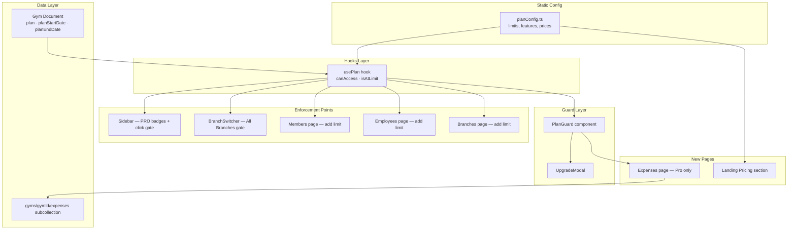

# Design Document: Subscription Pricing

## Overview

This design introduces a tiered subscription system for PingFlow with three plan types — Trial, Starter, and Pro. The system is built entirely on the existing React + TypeScript + Firebase stack, adding a centralized plan configuration module, a `usePlan` hook for runtime access, a `PlanGuard` wrapper component, and an `UpgradeModal` for upsell prompts. Plan metadata is stored on the existing Gym Firestore document. Resource limits (members, employees, branches) are enforced at the UI layer before Firestore writes. Pro-only features (Broadcast, Expenses, Analytics, Global View) are gated via the Sidebar and BranchSwitcher. A new Expenses page and a public Landing page Pricing section are also included.

The design prioritizes zero-backend-change enforcement — all gating logic runs on the frontend using the existing `authStore` Zustand state. The plan configuration is a static TypeScript module with no runtime computation, making it tree-shakeable and testable in isolation.

## Architecture



The architecture follows a layered approach:

1. **Static Config** — `planConfig.ts` is the single source of truth for limits, features, and prices. No runtime computation; all values are compile-time constants.
2. **Hooks Layer** — `usePlan` reads `gym.plan` from the Zustand `authStore` and exposes `canAccess(feature)` and `isAtLimit(resource, count)` helpers.
3. **Guard Layer** — `PlanGuard` wraps Pro-only content and renders `UpgradeModal` when access is denied. `UpgradeModal` is a standalone modal showing plan comparison and upgrade CTA.
4. **Enforcement Points** — Sidebar items, BranchSwitcher, and resource-creation buttons all call `usePlan` to check access before proceeding.
5. **Data Layer** — Three new fields on the Gym document (`plan`, `planStartDate`, `planEndDate`) and a new `expenses` subcollection under each gym.

## Components and Interfaces

### 1. Plan Configuration (`frontend/src/config/planConfig.ts`)

Static module exporting typed constants. No classes, no runtime logic.

```typescript
export type PlanType = 'trial' | 'starter' | 'pro';
export type FeatureName = 'billing' | 'automations' | 'broadcast' | 'expenses' | 'analytics' | 'globalView';
export type ResourceName = 'members' | 'employees' | 'branches';

export interface PlanLimits {
  members: number;
  employees: number;
  branches: number;
}

export const PLAN_LIMITS: Record<PlanType, PlanLimits> = {
  trial:   { members: 100, employees: 2, branches: 1 },
  starter: { members: 100, employees: 2, branches: 1 },
  pro:     { members: Infinity, employees: Infinity, branches: Infinity },
};

export const PLAN_FEATURES: Record<PlanType, FeatureName[]> = {
  trial:   ['billing', 'automations'],
  starter: ['billing', 'automations'],
  pro:     ['billing', 'automations', 'broadcast', 'expenses', 'analytics', 'globalView'],
};

export const PLAN_PRICES = {
  starter: { monthly: 499, yearly: 4990 },
  pro:     { monthly: 999, yearly: 9990 },
} as const;
```

### 2. Plan Hook (`frontend/src/hooks/usePlan.ts`)

```typescript
interface UsePlanReturn {
  plan: PlanType;
  limits: PlanLimits;
  features: FeatureName[];
  canAccess: (feature: FeatureName) => boolean;
  isAtLimit: (resource: ResourceName, currentCount: number) => boolean;
}
```

- Reads `gym.plan` from `useAuthStore()`.
- Defaults to `'trial'` if `gym.plan` is `undefined` or missing.
- `canAccess` checks inclusion in `PLAN_FEATURES[plan]`.
- `isAtLimit` compares `currentCount >= PLAN_LIMITS[plan][resource]`.

### 3. PlanGuard Component (`frontend/src/components/ui/PlanGuard.tsx`)

```typescript
interface PlanGuardProps {
  feature: FeatureName;
  children: React.ReactNode;
}
```

- If `canAccess(feature)` returns `true`, renders `children`.
- Otherwise, renders `UpgradeModal` with the feature name as the reason.

### 4. UpgradeModal Component (`frontend/src/components/ui/UpgradeModal.tsx`)

```typescript
interface UpgradeModalProps {
  isOpen: boolean;
  onClose: () => void;
  reason?: string; // e.g. "broadcast" or "Member limit reached"
}
```

- Reuses the existing `Modal` component shell.
- Displays a two-column comparison of Starter vs Pro features.
- Shows the `reason` prop as a contextual message at the top.
- CTA button for upgrade (links to contact/Razorpay — placeholder for now).

### 5. Expense Service (`frontend/src/services/expense.service.ts`)

```typescript
export interface ExpenseEntry {
  id?: string;
  category: ExpenseCategory;
  amount: number;
  date: Timestamp;
  description?: string;
  createdAt: Timestamp;
}

export type ExpenseCategory = 'Rent' | 'Salary' | 'Utilities' | 'Equipment' | 'Other';
```

Follows the same pattern as `wallet.service.ts` — CRUD functions operating on `gyms/{gymId}/expenses`. Uses `addDoc`, `updateDoc`, `deleteDoc`, and `onSnapshot` for real-time subscription.

### 6. Expenses Page (`frontend/src/pages/Expenses.tsx`)

- Wrapped in `PlanGuard` with `feature="expenses"`.
- Lists expense entries for the current gym, filtered by selected month.
- Add/Edit/Delete expense forms via Modal.
- Displays monthly total at the top.

### 7. Landing Pricing Section (added to `frontend/src/pages/Landing.tsx`)

- Two plan cards: Starter and Pro.
- Monthly/Yearly toggle using local state.
- Reads prices from `PLAN_PRICES` in `planConfig.ts`.
- Pro card has gradient border (`linear-gradient(135deg, #E11D48, #8B5CF6)`).
- "Most Popular" badge on Pro, "14-day free trial" badge on both.

### 8. Sidebar Modifications (`frontend/src/components/layout/Sidebar.tsx`)

- Import `usePlan` hook.
- For nav items `Broadcast`, `Expenses`, `Analytics`: if `!canAccess(feature)`, show a "PRO" badge and intercept click to open `UpgradeModal` instead of navigating.

### 9. BranchSwitcher Modifications (`frontend/src/components/ui/BranchSwitcher.tsx`)

- Import `usePlan` hook.
- "All Branches" option: if `!canAccess('globalView')`, show "PRO" badge and open `UpgradeModal` on click instead of setting `activeBranchId(null)`.

### 10. Type Extensions (`frontend/src/types/index.ts`)

Add to the existing `Gym` interface:

```typescript
plan?: 'trial' | 'starter' | 'pro';
planStartDate?: Timestamp;
planEndDate?: Timestamp;
```

Add new `ExpenseEntry` type to the types file.

## Data Models

### Gym Document Extensions

Path: `gyms/{gymId}`

| Field | Type | Default | Description |
|-------|------|---------|-------------|
| `plan` | `'trial' \| 'starter' \| 'pro'` | `'trial'` | Current subscription tier |
| `planStartDate` | `Timestamp` | Current time at signup | When the current plan period started |
| `planEndDate` | `Timestamp` | 14 days from signup | When the current plan period ends |

These fields are set during gym creation (signup flow) and updated when a plan change occurs. The `useAuth` hook already loads the full gym document into the Zustand store, so no additional fetching is needed.

### Expense Entry Document

Path: `gyms/{gymId}/expenses/{expenseId}`

| Field | Type | Required | Description |
|-------|------|----------|-------------|
| `category` | `'Rent' \| 'Salary' \| 'Utilities' \| 'Equipment' \| 'Other'` | Yes | Expense category |
| `amount` | `number` | Yes | Amount in INR |
| `date` | `Timestamp` | Yes | Date of the expense |
| `description` | `string` | No | Optional note |
| `createdAt` | `Timestamp` | Yes | Server timestamp |

### Firestore Security Rules Addition

```
match /gyms/{gymId}/expenses/{expenseId} {
  allow read, write: if request.auth != null && request.auth.uid == gymId;
}
```


## Correctness Properties

*A property is a characteristic or behavior that should hold true across all valid executions of a system — essentially, a formal statement about what the system should do. Properties serve as the bridge between human-readable specifications and machine-verifiable correctness guarantees.*

Three properties were identified from the prework analysis. Property 2.2 (hook returns correct data) was removed as redundant — it is fully subsumed by Properties 1 and 2 below.

### Property 1: Feature access correctness

*For any* valid PlanType and *for any* FeatureName, `canAccess(feature)` SHALL return `true` if and only if the feature is included in `PLAN_FEATURES[plan]`.

**Validates: Requirements 2.3**

### Property 2: Resource limit correctness

*For any* valid PlanType, *for any* ResourceName, and *for any* non-negative integer `currentCount`, `isAtLimit(resource, currentCount)` SHALL return `true` if and only if `currentCount >= PLAN_LIMITS[plan][resource]`.

**Validates: Requirements 2.4**

### Property 3: Monthly expense total correctness

*For any* list of ExpenseEntry objects and *for any* selected month (year + month), the computed monthly total SHALL equal the sum of `amount` values for entries whose `date` falls within that month.

**Validates: Requirements 6.6**

## Error Handling

| Scenario | Handling |
|----------|----------|
| `gym.plan` is `undefined` or missing | `usePlan` defaults to `'trial'` — most restrictive tier. No error thrown. |
| `canAccess` called with unknown feature name | Returns `false` (feature not in any list). TypeScript's `FeatureName` type prevents this at compile time. |
| `isAtLimit` called with negative count | Returns `false` (negative < any limit). Edge case handled naturally by `>=` comparison. |
| Expense creation fails (Firestore write error) | Catch in `expense.service.ts`, surface via `toast('Failed to save expense', 'error')`. Form stays open for retry. |
| Expense deletion fails | Catch and toast error. Entry remains in list. |
| UpgradeModal CTA clicked but no payment integration | Button opens a placeholder contact link. No error — graceful degradation. |
| BranchSwitcher "All Branches" clicked on non-Pro | UpgradeModal opens. No navigation occurs. No error state. |
| Sidebar Pro-gated item clicked on non-Pro | UpgradeModal opens. `e.preventDefault()` stops navigation. No error state. |
| Plan field has invalid value (not trial/starter/pro) | `usePlan` defaults to `'trial'`. TypeScript union type catches this at compile time for internal code. |

## Testing Strategy

### Unit Tests (Example-Based)

Unit tests cover specific scenarios, UI rendering, and integration points:

- **Plan config constants**: Verify exact values for limits, features, and prices (Req 1.1–1.5)
- **usePlan default behavior**: Verify fallback to `'trial'` when `gym.plan` is undefined (Req 2.5)
- **PlanGuard rendering**: Verify children render when access is granted, UpgradeModal renders when denied (Req 3.1–3.3)
- **UpgradeModal content**: Verify plan comparison, CTA button, reason display, close behavior (Req 4.1–4.4)
- **Expense categories**: Verify exactly five categories are defined (Req 6.5)
- **Pricing section**: Verify two cards, toggle behavior, correct prices, badges (Req 7.1–7.7)
- **Sidebar gating**: Verify PRO badges on non-Pro plans, no badges on Pro (Req 8.1–8.3)
- **BranchSwitcher gating**: Verify PRO badge and UpgradeModal on non-Pro (Req 9.1–9.3)
- **Resource limit enforcement UI**: Verify UpgradeModal shown at limit, allowed below limit (Req 10–12)

### Property-Based Tests

Property-based tests verify universal correctness across all valid inputs. Use [fast-check](https://github.com/dubzzz/fast-check) as the PBT library.

Each property test must:
- Run a minimum of **100 iterations**
- Reference its design document property via tag comment
- Use the format: `// Feature: subscription-pricing, Property {N}: {title}`

**Property 1 test**: Generate random (PlanType, FeatureName) pairs. Assert `canAccess` result matches `PLAN_FEATURES[plan].includes(feature)`.

**Property 2 test**: Generate random (PlanType, ResourceName, non-negative integer) triples. Assert `isAtLimit` result matches `count >= PLAN_LIMITS[plan][resource]`.

**Property 3 test**: Generate random lists of `{ amount: number, date: Date }` objects and a random target month. Assert the computed monthly total equals the filtered sum.

### Integration Tests

- Expense CRUD operations against Firestore emulator (Req 6.1–6.4)
- Gym document plan field defaults during signup (Req 5.4)

### What Is NOT Tested with PBT

- UI rendering (PlanGuard, UpgradeModal, Sidebar badges, Pricing section) — use example-based component tests
- Firestore read/write operations — use integration tests with emulator
- Visual styling (gradient borders, badge colors) — manual/visual review
