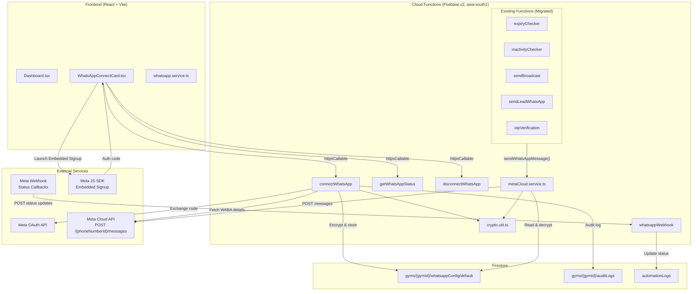
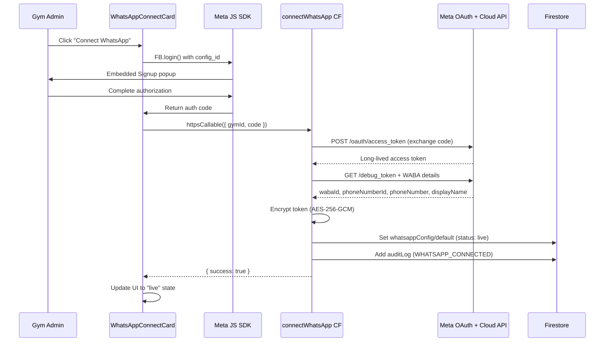
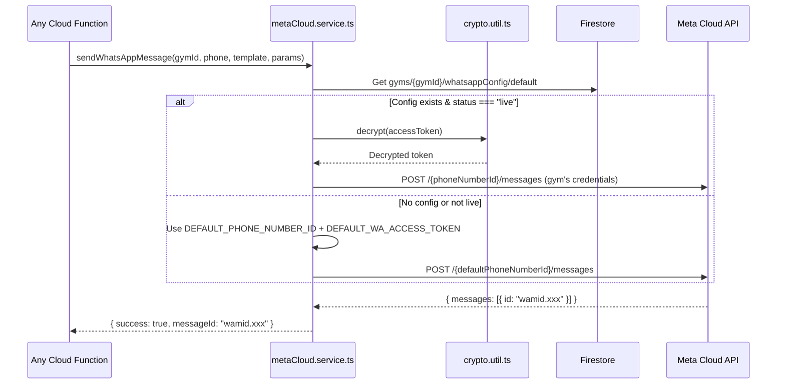

# Design Document: WhatsApp Connect

## Overview

WhatsApp Connect replaces PingFlow's current AiSensy-based WhatsApp integration with a direct Meta WhatsApp Cloud API integration. Each gym owner connects their own WhatsApp Business number via Meta's Embedded Signup flow, enabling branded messaging from their own number. Gyms that haven't connected fall back to Pixalara's shared default number, preserving existing functionality.

The migration touches every WhatsApp-sending path in the system: expiry automations, inactivity alerts, broadcasts, lead outreach, and OTP verification. A new `metaCloud.service.ts` module provides a unified `sendWhatsAppMessage` function that resolves credentials per-gym, encrypts tokens at rest, and handles the fallback logic. A webhook endpoint receives delivery status callbacks from Meta, replacing the current polling-based status sync.

On the frontend, a new WhatsApp Connect Card on the Dashboard guides gym admins through the Embedded Signup flow and displays real-time connection status.

**Key design decisions:**
- **Single service module**: All WhatsApp sending goes through one function (`sendWhatsAppMessage`) that resolves gym-specific vs. default credentials, eliminating scattered AiSensy API calls across 6+ files.
- **Encryption at rest**: Access tokens are AES-256-GCM encrypted before Firestore storage. A corrupted/wrong key triggers graceful fallback to the default number.
- **Webhook over polling**: Meta pushes delivery statuses via webhook, replacing the current `syncMessageStatuses` polling approach.
- **Progressive migration**: The fallback-to-default pattern means gyms can migrate at their own pace without service interruption.

## Architecture

### High-Level System Architecture



### Request Flow: Connecting WhatsApp



### Request Flow: Sending a Message (with fallback)




## Components and Interfaces

### Backend Components

#### 1. `functions/src/whatsapp/metaCloud.service.ts` — Message Service

The core module replacing `aisensy.service.ts`. Provides a single entry point for all WhatsApp messaging.

```typescript
// Public API
export async function sendWhatsAppMessage(
  gymId: string,
  phoneNumber: string,
  templateName: string,
  templateParams: string[],
  languageCode?: string  // defaults to "en"
): Promise<SendMessageResult>;

export interface SendMessageResult {
  success: boolean;
  messageId: string | null;
  error: string | null;
}
```

**Internal flow:**
1. Look up `gyms/{gymId}/whatsappConfig/default`
2. If `status === "live"`, decrypt the stored access token and use the gym's `phoneNumberId`
3. If no config or `status !== "live"`, use `DEFAULT_PHONE_NUMBER_ID` and `DEFAULT_WA_ACCESS_TOKEN` from env
4. Format phone number (strip non-digits, prepend `91` if 10 digits)
5. POST to `https://graph.facebook.com/v21.0/{phoneNumberId}/messages` with the template payload
6. Return `{ success, messageId, error }`

**Meta Cloud API request format:**
```json
{
  "messaging_product": "whatsapp",
  "to": "919876543210",
  "type": "template",
  "template": {
    "name": "gym_expiry_reminder_d3",
    "language": { "code": "en" },
    "components": [
      {
        "type": "body",
        "parameters": [
          { "type": "text", "text": "Rahul" },
          { "type": "text", "text": "FitZone Gym" },
          { "type": "text", "text": "15/05/2026" }
        ]
      }
    ]
  }
}
```

#### 2. `functions/src/whatsapp/crypto.util.ts` — Token Encryption

Handles AES-256-GCM encryption/decryption of access tokens.

```typescript
export function encryptToken(plaintext: string): string;
// Returns: base64(iv + ciphertext + authTag)

export function decryptToken(encrypted: string): string;
// Input: base64 string from encryptToken
// Returns: original plaintext
// Throws: Error if decryption fails (wrong key, corrupted data)
```

**Implementation details:**
- Uses Node.js built-in `crypto` module (no additional dependencies)
- 12-byte random IV per encryption
- 16-byte auth tag appended to ciphertext
- Key sourced from `TOKEN_ENCRYPTION_KEY` env var (32-byte hex string)
- Storage format: `base64(IV[12] + ciphertext[N] + authTag[16])`

#### 3. `functions/src/whatsapp/whatsappConnect.ts` — Connection Management Cloud Functions

Three callable Cloud Functions for managing the WhatsApp connection lifecycle.

```typescript
// Connect: Exchange Meta auth code for credentials, store encrypted
export const connectWhatsApp = onCall(
  { region: 'asia-south1' },
  async (request) => {
    // Input: { gymId: string, code: string }
    // Returns: { success: boolean, error?: string }
  }
);

// Status: Read current connection state
export const getWhatsAppStatus = onCall(
  { region: 'asia-south1' },
  async (request) => {
    // Input: { gymId: string }
    // Returns: { status, phoneNumber, displayName }
  }
);

// Disconnect: Delete config, revert to default
export const disconnectWhatsApp = onCall(
  { region: 'asia-south1' },
  async (request) => {
    // Input: { gymId: string }
    // Returns: { success: boolean }
  }
);
```

**`connectWhatsApp` flow:**
1. Verify `request.auth.uid === gymId` (admin-only)
2. Exchange auth code for long-lived token: `POST https://graph.facebook.com/v21.0/oauth/access_token` with `client_id`, `client_secret` (META_APP_SECRET), and the code
3. Fetch WABA details: `GET https://graph.facebook.com/v21.0/debug_token?input_token={token}` then fetch shared WABA info
4. Encrypt the access token via `crypto.util.ts`
5. Write to `gyms/{gymId}/whatsappConfig/default` with `status: "live"`
6. Log audit event `WHATSAPP_CONNECTED`

#### 4. `functions/src/whatsapp/webhook.ts` — Webhook Endpoint

An HTTP Cloud Function (not callable) that handles Meta's webhook verification and status callbacks.

```typescript
// HTTP function (onRequest), not onCall
export const whatsappWebhook = onRequest(
  { region: 'asia-south1' },
  async (req, res) => { ... }
);
```

**GET handler (verification):**
- Check `hub.mode === "subscribe"` and `hub.verify_token === WEBHOOK_VERIFY_TOKEN`
- Respond with `hub.challenge` value (HTTP 200) or HTTP 403

**POST handler (status callbacks):**
- Verify `X-Hub-Signature-256` using HMAC-SHA256 with `META_APP_SECRET`
- Use `crypto.timingSafeEqual` for comparison
- Parse `entry[].changes[].value.statuses[]` for message status updates
- Map `wamid` to automation log documents and update `currentStatus`
- Always respond HTTP 200 within 5 seconds

**Status mapping:**
| Meta Status | Firestore `currentStatus` |
|-------------|--------------------------|
| `sent`      | `Sent`                   |
| `delivered` | `Delivered`              |
| `read`      | `Read`                   |
| `failed`    | `Failed`                 |

### Frontend Components

#### 5. `frontend/src/components/ui/WhatsAppConnectCard.tsx`

A dashboard card component visible only to admin users.

**Props:** None (reads gymId from `useAuthStore`, role from `useRole`)

**States:**
- `not_connected` → Shows benefits list + "Connect WhatsApp" button
- `pending` → Shows spinner + "Connecting..." text, polls every 3s
- `live` → Shows connected phone number, display name, "Disconnect" button

**Meta JS SDK integration:**
- Loads `https://connect.facebook.net/en_US/sdk.js` asynchronously
- Calls `FB.init({ appId: VITE_META_APP_ID })` on mount
- On "Connect" click: `FB.login(callback, { config_id: VITE_META_CONFIG_ID, response_type: 'code', override_default_response_type: true })`
- On success: calls `connectWhatsApp` Cloud Function with the returned code

#### 6. Updated `frontend/src/services/whatsapp.service.ts`

**Removed functions:**
- `sendInvoiceWhatsApp` (direct AiSensy call)
- `sendPaymentReminder` (direct AiSensy call)
- `testAiSensyConnection` (AiSensy-specific)

**New functions:**
```typescript
export async function connectWhatsApp(gymId: string, code: string): Promise<{ success: boolean; error?: string }>;
export async function getWhatsAppStatus(gymId: string): Promise<{ status: string; phoneNumber: string | null; displayName: string | null }>;
export async function disconnectWhatsApp(gymId: string): Promise<{ success: boolean; error?: string }>;
```

**Retained functions** (unchanged):
- `triggerManualAutomation`
- `syncMessageStatuses` (may be deprecated later since webhook handles this)
- `generateAIBroadcast`

### Migration Map: AiSensy → Meta Cloud API

| File | Current Call | New Call |
|------|-------------|----------|
| `expiryChecker.ts` | `sendTemplateMessage(gymId, phone, campaign, name, params)` | `sendWhatsAppMessage(gymId, phone, template, params)` |
| `inactivityChecker.ts` | `sendTemplateMessage(gymId, phone, campaign, name, params)` | `sendWhatsAppMessage(gymId, phone, template, params)` |
| `sendBroadcast.ts` | Direct `fetch(AISENSY_API, ...)` | `sendWhatsAppMessage(gymId, phone, template, [message])` |
| `sendLeadWhatsApp.ts` | Direct `fetch(AISENSY_API, ...)` | `sendWhatsAppMessage(gymId, phone, template, params)` |
| `otpVerification.ts` (4 places) | Direct `fetch(AISENSY_API, ...)` | `sendWhatsAppMessage('__default__', phone, template, params)` |
| `index.ts` (`testWhatsAppDelivery`) | `sendTemplateMessage(...)` | `sendWhatsAppMessage(gymId, phone, template, params)` |
| `index.ts` (`syncMessageStatuses`) | Polling-based | Replaced by webhook (keep for backward compat) |

**OTP special case:** OTP messages always use the default Pixalara number since they're sent during signup before a gym exists. The `gymId` parameter is passed as `'__default__'` to signal the service to skip config lookup and use default credentials directly.


## Data Models

### Firestore: `gyms/{gymId}/whatsappConfig/default`

This is a new subcollection document storing each gym's Meta WhatsApp credentials and connection state.

```typescript
interface WhatsAppConfig {
  wabaId: string;              // Meta WhatsApp Business Account ID
  phoneNumberId: string;       // Meta Phone Number ID (used in API calls)
  accessToken: string;         // AES-256-GCM encrypted, base64-encoded
  phoneNumber: string;         // Display format, e.g. "+91 98765 43210"
  displayName: string;         // WhatsApp Business display name
  status: 'not_connected' | 'pending' | 'live';
  metaBusinessId: string;      // Meta Business portfolio ID
  connectedAt: Timestamp;      // When the connection was established
}
```

**Firestore security rules addition:**
```
// WhatsApp config — admin only, Cloud Functions for write
match /gyms/{gymId}/whatsappConfig/{docId} {
  allow read: if isAdmin(gymId);
  allow write: if false; // Cloud Functions only (admin SDK bypasses rules)
}
```

The `write: false` rule ensures that only Cloud Functions (using the Admin SDK) can modify the encrypted credentials. Frontend can read the document for status display, but the `accessToken` field is encrypted so reading it provides no usable secret.

### Firestore: Updated `automationLogs` Schema

Existing automation log documents gain a new field for webhook-delivered status:

```typescript
// Existing fields remain unchanged, new fields added:
interface AutomationLogUpdate {
  // ... existing fields ...
  messageId?: string;          // NEW: Meta wamid for webhook correlation
  currentStatus?: 'Submitted' | 'Sent' | 'Delivered' | 'Read' | 'Failed';  // Updated by webhook
  lastStatusUpdate?: Timestamp; // NEW: When status was last updated by webhook
}
```

### Firestore: Updated `gyms/{gymId}` Schema

The gym document's existing `watiApiKey` and `watiApiEndpoint` fields become obsolete. They are not deleted immediately (backward compatibility) but are no longer read by any code path after migration.

### Environment Variables

#### Cloud Functions (`functions/.env`)

| Variable | Purpose | Example |
|----------|---------|---------|
| `META_APP_ID` | Meta App ID for OAuth | `123456789012345` |
| `META_APP_SECRET` | Meta App Secret for OAuth + webhook HMAC | `abc123def456...` |
| `WEBHOOK_VERIFY_TOKEN` | Custom token for webhook GET verification | `pingflow_webhook_2026` |
| `DEFAULT_PHONE_NUMBER_ID` | Pixalara's default Meta phone number ID | `106540352242922` |
| `DEFAULT_WA_ACCESS_TOKEN` | Pixalara's default Meta access token | `EAAx...` |
| `TOKEN_ENCRYPTION_KEY` | 32-byte hex key for AES-256-GCM | `a1b2c3d4...` (64 hex chars) |
| `META_CONFIG_ID` | Facebook Login for Business config ID | `987654321098765` |

**Removed after migration:**
- `AISENSY_API_KEY` — no longer needed

#### Frontend (`frontend/.env.local`)

| Variable | Purpose |
|----------|---------|
| `VITE_META_APP_ID` | Meta App ID for JS SDK initialization |
| `VITE_META_CONFIG_ID` | Facebook Login for Business configuration ID |

### TypeScript Types

New types added to `frontend/src/types/index.ts`:

```typescript
// WhatsApp Connection
export type WhatsAppConnectionStatus = 'not_connected' | 'pending' | 'live';

export interface WhatsAppStatus {
  status: WhatsAppConnectionStatus;
  phoneNumber: string | null;
  displayName: string | null;
}
```


## Correctness Properties

*A property is a characteristic or behavior that should hold true across all valid executions of a system — essentially, a formal statement about what the system should do. Properties serve as the bridge between human-readable specifications and machine-verifiable correctness guarantees.*

### Property 1: Token encryption round-trip

*For any* valid access token string, encrypting it with `encryptToken` and then decrypting the result with `decryptToken` SHALL produce the original token string. Additionally, the encrypted output SHALL be valid base64 and SHALL NOT contain the plaintext token as a substring.

**Validates: Requirements 1.4, 15.1, 15.2, 15.3**

### Property 2: Encryption non-determinism

*For any* valid access token string, encrypting it twice with `encryptToken` SHALL produce two different ciphertext strings (due to the random 12-byte IV), yet both SHALL decrypt to the original token.

**Validates: Requirements 15.1**

### Property 3: Admin-only access control

*For any* pair of `(callerUid, gymId)` where `callerUid !== gymId`, calling `connectWhatsApp` or `disconnectWhatsApp` SHALL reject the request with error code `permission-denied`.

**Validates: Requirements 2.6, 4.3, 17.1, 17.2, 17.3**

### Property 4: Credential resolution by connection status

*For any* gym, when `sendWhatsAppMessage` is called: if the gym's `whatsappConfig/default` document exists with `status === "live"`, the message SHALL be sent using the gym's own `phoneNumberId` and decrypted `accessToken`; otherwise (no document, `status !== "live"`, or decryption failure), the message SHALL be sent using `DEFAULT_PHONE_NUMBER_ID` and `DEFAULT_WA_ACCESS_TOKEN`.

**Validates: Requirements 4.4, 5.1, 5.2, 5.3, 15.4**

### Property 5: Phone number formatting

*For any* phone number string, after formatting by the Message_Service: the result SHALL contain only digit characters; if the original string contained exactly 10 digit characters, the result SHALL be those 10 digits prefixed with `91`; if the original string contained more or fewer than 10 digits, the result SHALL be the original digits unchanged.

**Validates: Requirements 5.6**

### Property 6: Message result shape invariant

*For any* input to `sendWhatsAppMessage`, the returned object SHALL contain exactly three fields: `success` (boolean), `messageId` (string or null), and `error` (string or null). When `success` is `true`, `messageId` SHALL be non-null and `error` SHALL be null. When `success` is `false`, `error` SHALL be non-null.

**Validates: Requirements 5.4**

### Property 7: Webhook verification echoes challenge

*For any* random challenge string, an HTTP GET request to the webhook endpoint with `hub.mode=subscribe`, `hub.verify_token` matching `WEBHOOK_VERIFY_TOKEN`, and `hub.challenge` set to that string SHALL respond with HTTP 200 and a body equal to the challenge string. For any `hub.verify_token` that does NOT match, the response SHALL be HTTP 403.

**Validates: Requirements 6.1, 6.2**

### Property 8: Webhook signature validation

*For any* request body and `META_APP_SECRET`, the webhook POST handler SHALL accept the request (HTTP 200) if and only if the `X-Hub-Signature-256` header equals `sha256=` followed by the HMAC-SHA256 hex digest of the body using `META_APP_SECRET`. All other signatures SHALL result in HTTP 401.

**Validates: Requirements 6.3, 6.4, 16.1, 16.2, 16.3**

### Property 9: Broadcast failure resilience

*For any* list of broadcast recipients where a subset of `sendWhatsAppMessage` calls fail, the `sendBroadcast` function SHALL attempt delivery to every recipient in the list, and the returned `failed` count SHALL equal the number of recipients for which `sendWhatsAppMessage` returned `success: false`.

**Validates: Requirements 9.3**

### Property 10: Connection status field constraint

*For any* sequence of operations (connect, disconnect, status queries) on a gym's WhatsApp configuration, the `status` field in the `whatsappConfig/default` document SHALL always be one of: `not_connected`, `pending`, or `live`.

**Validates: Requirements 1.2**


## Error Handling

### Cloud Function Errors

All Cloud Functions use Firebase's `HttpsError` with standardized error codes:

| Scenario | Error Code | Message |
|----------|-----------|---------|
| Unauthenticated caller | `unauthenticated` | `"Login required."` |
| Non-admin caller on connect/disconnect | `permission-denied` | `"Admin only"` |
| Invalid/expired Meta auth code | `invalid-argument` | `"Invalid or expired authorization code"` |
| Meta API failure during connect | `internal` | `"Failed to connect WhatsApp: {details}"` |
| Missing required env var | `failed-precondition` | `"Missing required environment variable: {VAR_NAME}"` |
| Missing gymId parameter | `invalid-argument` | `"gymId is required"` |

### Message Service Errors

`sendWhatsAppMessage` never throws — it always returns a `SendMessageResult`:

| Scenario | Behavior |
|----------|----------|
| Gym config exists, status=live, token decrypts | Send via gym's credentials |
| Gym config exists, token decryption fails | Log warning, fall back to default credentials |
| No gym config or status≠live | Use default credentials |
| Default credentials missing (env vars) | Return `{ success: false, messageId: null, error: "Default WhatsApp credentials not configured" }` |
| Meta API returns HTTP 4xx/5xx | Return `{ success: false, messageId: null, error: "{status}: {error_message}" }` |
| Network error (timeout, DNS) | Return `{ success: false, messageId: null, error: "Network error: {message}" }` |

### Webhook Error Handling

| Scenario | Response |
|----------|----------|
| GET with wrong verify_token | HTTP 403, empty body |
| POST with invalid/missing signature | HTTP 401, empty body |
| POST with valid signature but malformed body | HTTP 200 (acknowledge to prevent retries), log error |
| POST with valid status update but no matching log doc | HTTP 200, log warning (message may have been sent before webhook was set up) |
| Internal error during processing | HTTP 200 (always acknowledge), log error |

The webhook always returns HTTP 200 for valid POST requests to prevent Meta from retrying delivery, even if internal processing fails. Errors are logged for debugging.

### Frontend Error Handling

| Scenario | UI Behavior |
|----------|-------------|
| Embedded Signup popup closed without completing | Stay in `not_connected` state, no error shown |
| `connectWhatsApp` returns error | Show toast with error message, revert to `not_connected` |
| Polling `getWhatsAppStatus` fails | Retry on next poll interval, show error after 3 consecutive failures |
| `disconnectWhatsApp` returns error | Show toast with error message, keep current state |
| Meta JS SDK fails to load | Show "Connect WhatsApp" button disabled with tooltip "Unable to load Meta SDK" |

## Testing Strategy

### Property-Based Tests

Property-based testing is appropriate for this feature because several components have pure-function behavior with clear input/output contracts: encryption utilities, phone formatting, webhook verification, and credential resolution logic.

**Library:** [fast-check](https://github.com/dubzzz/fast-check) (TypeScript PBT library)

**Configuration:** Minimum 100 iterations per property test.

**Tag format:** `Feature: whatsapp-connect, Property {N}: {title}`

Each correctness property from the design document maps to a single property-based test:

| Property | Test File | What's Generated |
|----------|-----------|-----------------|
| P1: Token encryption round-trip | `crypto.util.test.ts` | Random strings (1–2000 chars, including unicode) |
| P2: Encryption non-determinism | `crypto.util.test.ts` | Random strings |
| P3: Admin-only access control | `whatsappConnect.test.ts` | Random (callerUid, gymId) pairs where uid ≠ gymId |
| P4: Credential resolution | `metaCloud.service.test.ts` | Random gym configs (present/absent, live/not_connected/pending) |
| P5: Phone number formatting | `metaCloud.service.test.ts` | Random phone strings (10-digit, 12-digit, with special chars) |
| P6: Message result shape | `metaCloud.service.test.ts` | Random inputs with mocked Meta API responses |
| P7: Webhook verification | `webhook.test.ts` | Random challenge strings and verify tokens |
| P8: Webhook signature validation | `webhook.test.ts` | Random request bodies and secrets |
| P9: Broadcast failure resilience | `sendBroadcast.test.ts` | Random recipient lists with random success/failure patterns |
| P10: Connection status constraint | `whatsappConnect.test.ts` | Random sequences of connect/disconnect operations |

### Unit Tests (Example-Based)

For specific scenarios, edge cases, and integration points not covered by property tests:

| Test | Covers |
|------|--------|
| `connectWhatsApp` with valid code (mocked Meta API) | Req 2.1–2.3, 2.7 |
| `connectWhatsApp` with invalid code | Req 2.4 |
| `connectWhatsApp` with Meta API failure | Req 2.5 |
| `getWhatsAppStatus` with no config | Req 1.3, 3.2 |
| `getWhatsAppStatus` without auth | Req 3.3 |
| `disconnectWhatsApp` deletes config + audit log | Req 4.1, 4.2 |
| Decryption failure triggers fallback | Req 15.4 |
| OTP functions don't throw on WhatsApp failure | Req 11.4 |
| Webhook status update writes to correct log doc | Req 6.5 |
| Missing env var returns failed-precondition | Req 14.2 |

### Integration Tests

For verifying the migration is complete and all callers use the new service:

| Test | Covers |
|------|--------|
| Expiry checker calls `sendWhatsAppMessage` | Req 7.1, 7.2 |
| Inactivity checker calls `sendWhatsAppMessage` | Req 8.1, 8.2 |
| Broadcast calls `sendWhatsAppMessage` per recipient | Req 9.1, 9.2 |
| Lead WhatsApp calls `sendWhatsAppMessage` | Req 10.1, 10.2 |
| OTP functions call `sendWhatsAppMessage` with default | Req 11.1–11.3 |
| No AiSensy imports remain in codebase | Req 12.1–12.5 |

### Frontend Tests

| Test | Covers |
|------|--------|
| WhatsAppConnectCard renders only for admin | Req 13.1 |
| Card shows connect button when not_connected | Req 13.2 |
| Card shows spinner when pending | Req 13.5 |
| Card shows phone + disconnect when live | Req 13.8 |
| Popup cancellation stays in not_connected | Req 13.10 |

