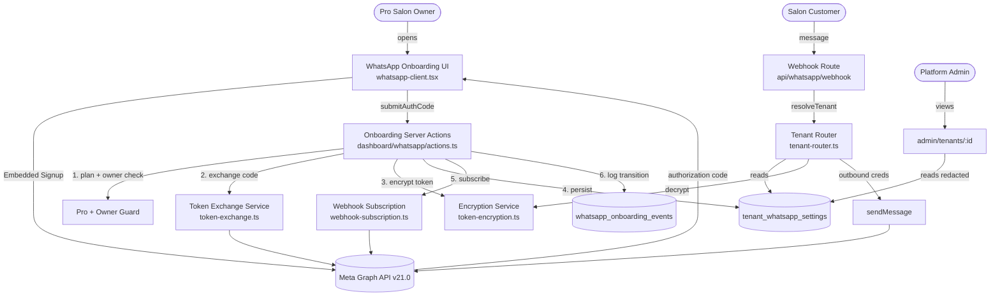
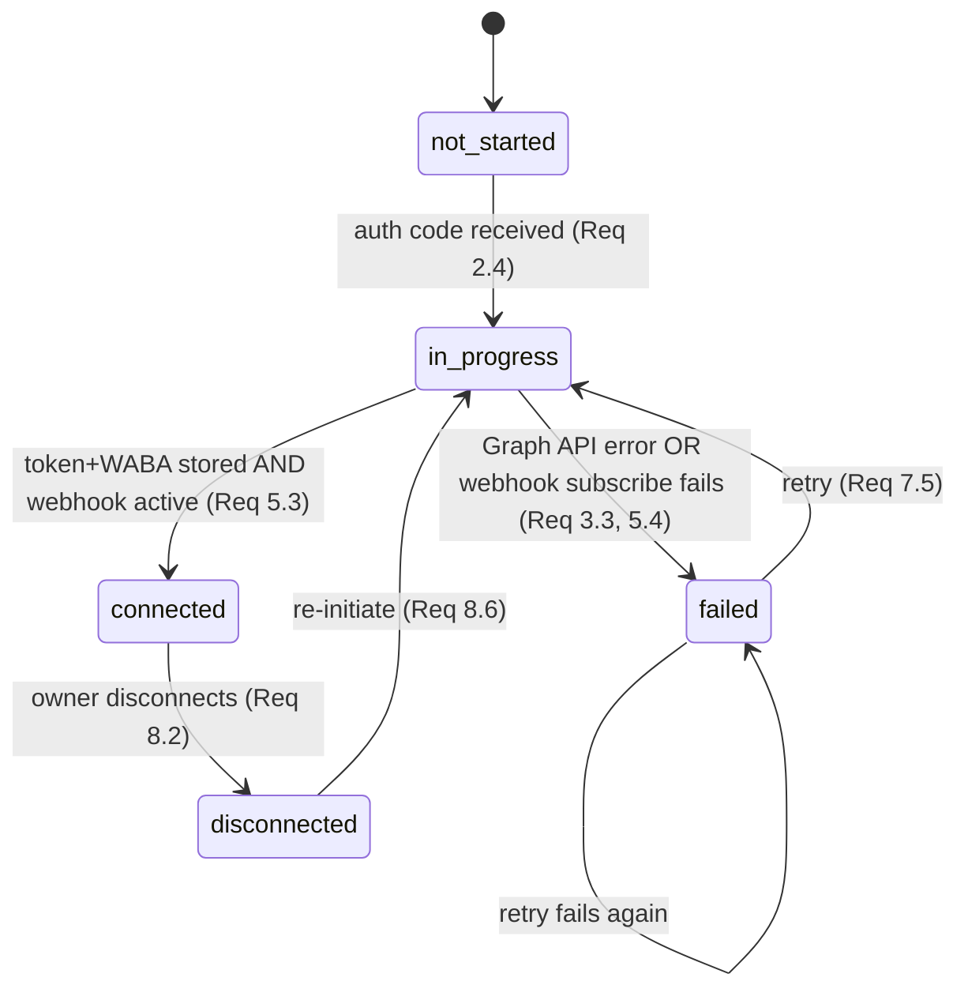
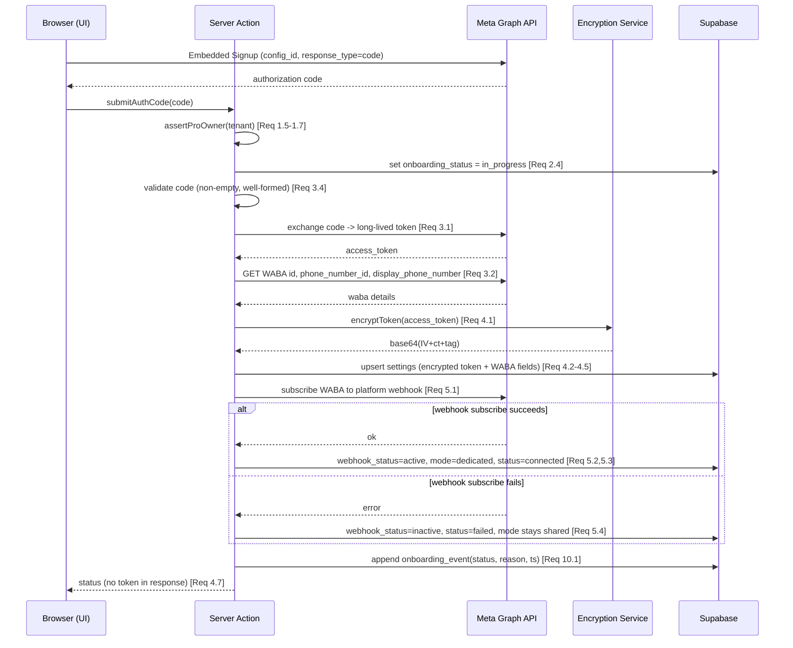

# Design Document

## Overview

This feature completes the unfinished `dedicated` WhatsApp path so that a Pro plan salon (Tenant)
can connect its own WhatsApp Business number, have outbound messages routed through that number, and
fall back safely to the shared platform number whenever the dedicated connection is not fully healthy.

Today the pieces exist but are disconnected:

- `tenant_whatsapp_settings` (migration `014_whatsapp_multi_tenant.sql`) already has `mode`, `waba_id`,
  `phone_number_id`, `display_phone_number`, `access_token_encrypted`, `display_name_status`,
  `webhook_status`, plus a unique index on `tenant_id`.
- The dedicated-connect UI (`dashboard/whatsapp/whatsapp-client.tsx`) runs Meta Embedded Signup but only
  `console.log`s the returned authorization `code` — nothing is persisted.
- `tenant-router.ts` has a `TODO: Decrypt access_token_encrypted` and currently returns
  `getPlatformCredentials()` as a placeholder for dedicated mode.
- There is no encryption module in the Next.js app, no plan-tier gating, and no onboarding status tracking.

The design closes these gaps with five focused additions, all grounded in existing patterns:

1. A **pure encryption module** (`src/lib/crypto/token-encryption.ts`) ported from the proven
   `functions/src/whatsapp/crypto.util.ts` (same AES-256-GCM format) so tokens are encrypted at rest.
2. A **token-exchange service** that turns an Embedded Signup code into a long-lived token plus WABA details.
3. **Onboarding server actions** (Pro-gated, owner-only) that orchestrate exchange → encrypt → persist →
   webhook subscribe → activate, and that drive an explicit **onboarding state machine**.
4. **Tenant-router changes** that decrypt and select dedicated credentials when (and only when) the Tenant
   is fully connected, and fall back to shared credentials otherwise.
5. A small **schema migration** adding `onboarding_status` + error/audit tracking, and a status display +
   disconnect UI for owners and a read-only view for admins.

### Research Notes

- **A working encryption implementation already exists in the repo.** `functions/src/whatsapp/crypto.util.ts`
  (Firebase functions codebase) implements exactly the storage format this design needs: AES-256-GCM with a
  12-byte random IV, a 16-byte auth tag, a 32-byte key from `TOKEN_ENCRYPTION_KEY` (64 hex chars), and an
  output of `base64(IV ‖ ciphertext ‖ authTag)`. The Next.js app (`snipglow/`) has no equivalent, so we port
  the same algorithm verbatim into `src/lib/crypto/token-encryption.ts`. Reusing the identical format means a
  token encrypted in one codebase can be decrypted in the other if ever needed, and the well-tested format is
  the lowest-risk choice. Source: `functions/src/whatsapp/crypto.util.ts`.
- **The Cloud API version is pinned.** `src/lib/whatsapp/config.ts` exports `WA_API_VERSION = 'v21.0'` and
  `WA_BASE_URL`. The token exchange and webhook-subscription calls in this feature reuse `WA_BASE_URL` so the
  Graph API version stays consistent across the app. (Note: `sender.ts` still hardcodes `v18.0`; this design
  does not change `sender.ts`, but the new onboarding code uses the shared `WA_BASE_URL` constant.)
- **Server actions + service-role pattern is established.** `dashboard/whatsapp/actions.ts` shows the
  `'use server'` + `createClient()` (auth) + `createAdminClient()` (service role) pattern. Onboarding actions
  reuse it: authenticate the user with the SSR client, then perform privileged writes with the admin client.
- **Admin visibility + audit are established.** `admin/tenants/[id]/page.tsx` already fetches
  `tenant_whatsapp_settings` and renders a "WhatsApp Settings" section, and `src/lib/admin/auth.ts` exposes
  `logAdminAction(...)` whose failures are already swallowed (try/catch) so a logging error never breaks a
  page render — directly satisfying Requirement 9.5.
- **Embedded Signup is already wired client-side.** `whatsapp-client.tsx` loads the Facebook SDK, calls
  `FB.login(..., { config_id, response_type: 'code', ... })`, and receives `response.authResponse.code`. We
  keep this flow and add the missing server round-trip.
- **Tooling for property testing is present.** `package.json` includes `vitest@^4` and `fast-check@^4` with a
  `node` test environment (`vitest.config.ts`) and the `@` path alias. No new test dependency is required.

## Architecture

### System Context

The onboarding flow spans the browser (Embedded Signup), Next.js server actions, the Meta Graph API, Supabase,
and the existing webhook + sender path. The router sits at the boundary between inbound/outbound WhatsApp
traffic and the credential store.



### Onboarding State Machine

`onboarding_status` is the single source of truth for "where is this Tenant in the dedicated flow". Outbound
routing keys off it: only `connected` selects dedicated credentials. The legal transitions are:



Invariant that ties the machine to delivery: **while `onboarding_status != connected`, the Tenant is treated
as Shared_Mode for outbound routing** (Req 5.5), regardless of any partially-written dedicated fields.

### End-to-End Connect Sequence



### Key Architectural Decisions

1. **Encryption is a pure, dependency-free module.** `token-encryption.ts` exposes `encryptToken` /
   `decryptToken` with no I/O. The IV is generated per call and stored inline with the ciphertext (so callers
   never manage IVs), which makes the round-trip and fail-closed behavior directly property-testable.

2. **`onboarding_status` drives delivery, not the presence of fields.** Even if `access_token_encrypted` and
   `phone_number_id` are written, the router only uses them when `status == connected` and `mode == dedicated`.
   This makes "partially onboarded" states safe (Req 5.5) and keeps a single, explicit gate.

3. **Orchestration lives in server actions; the router stays a pure-ish selector.** The connect/disconnect/retry
   sequencing (exchange → encrypt → persist → subscribe → activate) lives in `actions.ts`. The router's only job
   is, given a Tenant's settings, to return the correct `WhatsAppCredentials` (decrypting on demand) or fall back
   — keeping the resolution logic small and testable.

4. **Fail-closed routing.** Any failure to produce usable dedicated credentials (decryption error, missing field)
   makes the router fall back to shared/platform credentials and record an error reason (Req 6.4), so a broken
   dedicated config degrades to "messages still send from the platform number" rather than "messages stop".

5. **Reuse the existing webhook + sender path.** The dedicated number routes inbound through the same
   `api/whatsapp/webhook` handler (matched by `phone_number_id`) and sends outbound through the same
   `sendMessage(credentials, ...)`; the only new thing is which credentials the router hands over.

## Components and Interfaces

### New modules

| Module | Path | Responsibility |
| --- | --- | --- |
| Encryption Service | `src/lib/crypto/token-encryption.ts` | Pure `encryptToken`/`decryptToken` (AES-256-GCM), ported from `functions/src/whatsapp/crypto.util.ts`. |
| Onboarding State | `src/lib/whatsapp/onboarding-status.ts` | `OnboardingStatus` type, legal-transition table, `canTransition`, derived UI control flags, default-status helper. |
| Token Exchange Service | `src/lib/whatsapp/token-exchange.ts` | `exchangeCodeForToken(code)` and `fetchWabaDetails(token)` against `WA_BASE_URL`; `validateAuthCode(code)`. |
| Webhook Subscription | `src/lib/whatsapp/webhook-subscription.ts` | `subscribeWaba(wabaId, token)` → calls Graph API `{waba-id}/subscribed_apps`. |
| Onboarding Logging | `src/lib/whatsapp/onboarding-log.ts` | `recordOnboardingEvent(tenantId, status, reason?)` (best-effort, never throws). |
| Credential Store | `src/lib/whatsapp/credential-store.ts` | `upsertDedicatedCredentials(...)`, `clearDedicatedCredentials(...)`, `getSettings(tenantId)`; redaction-safe view mappers. |

### New / changed server actions

All onboarding server actions live in `src/app/(dashboard)/dashboard/whatsapp/actions.ts`, begin with an
authentication + Pro + owner check, and return **redacted** results (never the token).

| Action | Auth gate | Writes | Notes |
| --- | --- | --- | --- |
| `getOnboardingState()` | owner of tenant | — | Returns `{ status, mode, displayPhoneNumber, webhookStatus, errorReason, controls }`. Defaults to `not_started` (Req 10.5, 7.1). |
| `submitAuthCode(code)` | Pro + owner | settings, events | Orchestrates the full connect sequence. Rejects non-Pro/non-owner before any exchange (Req 1.5–1.7). |
| `retryOnboarding()` | Pro + owner | settings, events | Restarts from the failed step, preserving valid prior progress (Req 7.5). Only allowed when `status == failed`. |
| `disconnectDedicated()` | Pro + owner | settings, events | Atomic revert to shared + clear credentials (Req 8.2–8.5). |

Shared guard:

```ts
// returns { tenantId } or throws AuthorizationError / returns { error } per action contract
async function assertProOwner(): Promise<{ tenantId: string }> {
  const supabase = await createClient();
  const { data: { user } } = await supabase.auth.getUser();
  if (!user) throw new AuthorizationError('not_authenticated');
  const tenantId = user.user_metadata?.tenant_id;
  const role = user.user_metadata?.role;
  if (!tenantId || role !== 'owner') throw new AuthorizationError('not_owner'); // Req 1.7
  const admin = createAdminClient();
  const { data: tenant } = await admin.from('tenants').select('plan_tier').eq('id', tenantId).single();
  if (tenant?.plan_tier !== 'pro') throw new AuthorizationError('not_pro');     // Req 1.5, 1.6
  return { tenantId };
}
```

### Encryption Service interface

```ts
// src/lib/crypto/token-encryption.ts — ported from functions/src/whatsapp/crypto.util.ts
// AES-256-GCM, 12-byte IV, 16-byte auth tag, key = TOKEN_ENCRYPTION_KEY (64 hex chars).
export function encryptToken(plaintext: string): string;   // -> base64(IV[12] + ciphertext[N] + authTag[16])
export function decryptToken(encrypted: string): string;    // throws on wrong key / corrupted / tampered data
```

### Token Exchange Service interface

```ts
// src/lib/whatsapp/token-exchange.ts
export type AuthCodeValidation = { ok: true } | { ok: false; reason: 'empty' | 'malformed' };
export function validateAuthCode(code: string | null | undefined): AuthCodeValidation; // Req 3.4/3.5

export interface WabaDetails {
  wabaId: string;
  phoneNumberId: string;
  displayPhoneNumber: string;
}
export interface ExchangeResult {
  ok: boolean;
  accessToken?: string;
  waba?: WabaDetails;
  errorReason?: string; // Req 3.3 — descriptive, never contains a token
}
export async function exchangeCodeForToken(code: string): Promise<ExchangeResult>; // 30s timeout (Req 3.6)
```

### Onboarding State interface

```ts
// src/lib/whatsapp/onboarding-status.ts
export type OnboardingStatus =
  | 'not_started' | 'in_progress' | 'connected' | 'failed' | 'disconnected';

export const LEGAL_TRANSITIONS: Record<OnboardingStatus, OnboardingStatus[]>;
export function canTransition(from: OnboardingStatus, to: OnboardingStatus): boolean;

export interface OnboardingControls {
  showConnect: boolean;     // suppressed while in_progress (Req 7.6)
  showRetry: boolean;       // iff failed (Req 7.3, 7.4)
  showDisconnect: boolean;  // iff connected (Req 8.1)
  showProgress: boolean;    // iff in_progress (Req 7.6)
}
export function controlsFor(status: OnboardingStatus): OnboardingControls;
export function defaultStatus(): OnboardingStatus; // 'not_started' (Req 10.5)
```

### Tenant-router changes

The `TODO`s in `tenant-router.ts` are replaced by a single resolution helper. The router decrypts on demand
and selects credentials by the onboarding gate; any failure falls back to shared and records a reason.

```ts
// src/lib/whatsapp/tenant-router.ts (new internal helper)
interface DedicatedSettings {
  mode: 'shared' | 'dedicated' | null;
  onboarding_status: OnboardingStatus | null;
  phone_number_id: string | null;
  waba_id: string | null;
  access_token_encrypted: string | null;
}

// Returns dedicated credentials only when fully connected and decryptable;
// otherwise returns platform credentials (Req 5.5, 6.1, 6.2, 6.4, 6.5).
function resolveCredentials(
  settings: DedicatedSettings | null,
  platform: WhatsAppCredentials | null,
  recordError: (reason: string) => void,
): WhatsAppCredentials | null;
```

- `getCredentialsForTenant(tenantId)` and the dedicated branch of `resolveTenant(...)` both delegate to
  `resolveCredentials`, removing the placeholder that always returned platform credentials.
- Inbound dedicated routing keeps matching on `phone_number_id` (Req 6.3) but additionally requires the matched
  row to be `connected` before treating it as dedicated; otherwise it resolves the tenant but uses shared creds.

### UI components

- **Owner onboarding (`whatsapp-client.tsx`)**: replace the local-only `WhatsAppConnectCard` state with
  server-driven status. On mount, call `getOnboardingState()`. Render by status using `controlsFor(status)`:
  connected → show `display_phone_number` + confirmation (Req 7.2); failed → show `errorReason` + Retry
  (Req 7.3); in_progress → progress indicator, connect hidden (Req 7.6); connected → Disconnect (Req 8.1).
  After Embedded Signup returns a code, call `submitAuthCode(code)`; on cancel/SDK-not-ready, show a message
  and submit nothing (Req 2.3, 2.5).
- **Admin (`admin/tenants/[id]/page.tsx`)**: extend the existing "WhatsApp Settings" section to show `mode`,
  `onboarding_status`, `display_phone_number`, and `webhook_status` (Req 9.1), via a redaction-safe view mapper
  that omits both `access_token_encrypted` and any plaintext (Req 9.2). When no row exists, show "Dedicated
  WhatsApp not configured" (Req 9.3). Audit logging stays via the existing `logAdminAction` (Req 9.4/9.5).

## Data Models

### Existing table (migration 014) — unchanged columns reused

`tenant_whatsapp_settings` already provides: `mode`, `booking_slug`, `waba_id`, `phone_number_id`,
`display_phone_number`, `access_token_encrypted`, `display_name`, `display_name_status`, `webhook_status`,
plus `UNIQUE INDEX idx_tenant_whatsapp_tenant (tenant_id)` (satisfies Req 4.4) and an index on
`phone_number_id` (supports Req 6.3 inbound routing).

### New migration `025_whatsapp_onboarding_status.sql`

Adds the onboarding status + error tracking the feature needs, and an append-only event log for transitions
(Req 10.1). No existing column is altered (Req 9.4 / schema preservation).

```sql
-- Onboarding status + last error on the existing settings table
ALTER TABLE tenant_whatsapp_settings
  ADD COLUMN IF NOT EXISTS onboarding_status TEXT NOT NULL DEFAULT 'not_started'
    CHECK (onboarding_status IN ('not_started','in_progress','connected','failed','disconnected')),
  ADD COLUMN IF NOT EXISTS onboarding_error TEXT,                 -- descriptive reason, never a token (Req 3.3)
  ADD COLUMN IF NOT EXISTS onboarding_updated_at TIMESTAMPTZ;

-- Append-only onboarding event log (Req 10.1, 10.4)
CREATE TABLE IF NOT EXISTS whatsapp_onboarding_events (
  id UUID PRIMARY KEY DEFAULT gen_random_uuid(),
  tenant_id UUID NOT NULL REFERENCES tenants(id) ON DELETE CASCADE,
  status TEXT NOT NULL,        -- new onboarding_status after the transition
  reason TEXT,                 -- optional descriptive reason (never a token, Req 10.3)
  created_at TIMESTAMPTZ NOT NULL DEFAULT now()
);
CREATE INDEX IF NOT EXISTS idx_wa_onboarding_events_tenant
  ON whatsapp_onboarding_events(tenant_id, created_at DESC);
```

### Logical model

| Field | Source | Meaning in this feature |
| --- | --- | --- |
| `onboarding_status` | new | State-machine value; the single gate for dedicated delivery. Defaults to `not_started` (Req 10.5). |
| `onboarding_error` | new | Last descriptive failure reason shown on Retry (Req 7.3); excludes tokens (Req 3.3). |
| `mode` | 014 | `dedicated` only after a successful connect (Req 5.3); reverts to `shared` on disconnect/failure. |
| `waba_id` | 014 | Dedicated WABA id; used as outbound `businessAccountId` and for webhook subscribe. |
| `phone_number_id` | 014 | Dedicated number id; inbound routing key (Req 6.3) and outbound `phoneNumberId`. |
| `display_phone_number` | 014 | Human-readable number shown to owner/admin (Req 7.2, 9.1). Cleared on disconnect (Req 8.4). |
| `access_token_encrypted` | 014 | `base64(IV ‖ ciphertext ‖ authTag)` (Req 4.2). Never stored/displayed in plaintext (Req 4.3, 4.7, 9.2). Cleared on disconnect (Req 8.4). |
| `webhook_status` | 014 | `active` after subscribe (Req 5.2); `inactive` on failure/disconnect (Req 5.4, 8.2). |

### Credential mapping for the router

```ts
// dedicated credentials assembled only when connected + decryptable
const credentials: WhatsAppCredentials = {
  accessToken: decryptToken(settings.access_token_encrypted),
  phoneNumberId: settings.phone_number_id,
  businessAccountId: settings.waba_id,
};
```

## Correctness Properties

*A property is a characteristic or behavior that should hold true across all valid executions of a system —
essentially, a formal statement about what the system should do. Properties serve as the bridge between
human-readable specifications and machine-verifiable correctness guarantees.*

The following properties are derived from the prework analysis. Redundant acceptance criteria have been
consolidated so each property provides unique validation value. Properties target the pure, deterministic
cores of the feature (encryption, state machine, gating, credential selection, redaction); external Graph API
calls and pure rendering are covered by integration/example tests in the Testing Strategy instead.

### Property 1: Access token encryption round-trip

*For any* string access token, `decryptToken(encryptToken(token))` returns a plaintext equal to the original
token, and the encrypted output is not equal to the plaintext.

**Validates: Requirements 4.1, 4.6**

### Property 2: Decryption fails closed on tampered or invalid ciphertext

*For any* string that was not produced by `encryptToken` with the active key (random bytes, truncated, or
bit-flipped valid ciphertext), `decryptToken` throws rather than returning a usable token.

**Validates: Requirements 4.6, 6.4**

### Property 3: Plan-tier gating

*For any* Plan_Tier value, the onboarding gating returns the connect action as enabled if and only if the tier
equals `pro`, and otherwise returns the upgrade prompt.

**Validates: Requirements 1.2, 1.3, 1.4**

### Property 4: Non-Pro / non-owner requests never exchange

*For any* combination of Plan_Tier and user role where the tier is not `pro` or the role is not `owner`, every
dedicated onboarding server action is rejected with an authorization error, no token exchange is initiated, and
no credential write occurs.

**Validates: Requirements 1.5, 1.6, 1.7**

### Property 5: Authorization-code validation gates the Graph API call

*For any* authorization code string, validation succeeds if and only if the code is non-empty,
non-whitespace, and well-formed; the Meta Graph API exchange is invoked if and only if validation succeeds.

**Validates: Requirements 3.4, 3.5**

### Property 6: Connect outcome is determined by storage and webhook results

*For any* boolean pair `(storageSucceeded, webhookSucceeded)`, the connect orchestration produces a deterministic
final state: when both are true the result is `mode=dedicated`, `onboarding_status=connected`,
`webhook_status=active`; whenever the webhook step does not succeed the result is `webhook_status=inactive`,
`onboarding_status=failed`, and `mode` remains `shared`.

**Validates: Requirements 5.2, 5.3, 5.4**

### Property 7: Not-connected tenants route through shared credentials

*For any* WhatsApp_Settings whose `onboarding_status` is not `connected` (including `not_started`, `in_progress`,
`failed`, and `disconnected`), the Tenant_Router selects the platform (Shared_Mode) credentials for outbound
messages.

**Validates: Requirements 5.5, 8.5, 6.5**

### Property 8: Connected dedicated tenants route through decrypted dedicated credentials

*For any* access token, given a connected WhatsApp_Settings row with `mode=dedicated` and that token stored
encrypted, the Tenant_Router returns credentials whose `accessToken` equals the original token and whose
`phoneNumberId` and `businessAccountId` equal the row's `phone_number_id` and `waba_id`.

**Validates: Requirements 6.1, 6.2**

### Property 9: Decryption failure falls back to shared and records an error

*For any* connected dedicated row whose `access_token_encrypted` is not decryptable, the Tenant_Router returns
the platform credentials (or null when no platform credentials exist) and records an error reason for the
Tenant.

**Validates: Requirements 6.4, 6.5**

### Property 10: Inbound routing by dedicated phone number id

*For any* connected dedicated WhatsApp_Settings, an inbound webhook whose `phone_number_id` matches the row's
`phone_number_id` resolves to that row's Tenant.

**Validates: Requirements 6.3**

### Property 11: Onboarding control derivation

*For any* Onboarding_Status, the derived UI controls satisfy: retry is shown iff the status is `failed`;
disconnect is shown iff the status is `connected`; while `in_progress` the progress indicator is shown and the
connect action is hidden.

**Validates: Requirements 7.3, 7.4, 7.6, 8.1**

### Property 12: Onboarding transition legality

*For any* pair of Onboarding_Status values, `canTransition(from, to)` permits exactly the legal edges:
`not_started→in_progress`, `failed→in_progress`, `disconnected→in_progress`, `in_progress→connected`,
`in_progress→failed`, and `connected→disconnected`; all other transitions are rejected.

**Validates: Requirements 2.4, 7.5, 8.6**

### Property 13: Retry preserves valid prior progress

*For any* `failed` state carrying partial valid progress (e.g., already-fetched WABA fields), invoking retry
transitions the status to `in_progress` and preserves those valid fields rather than clearing them.

**Validates: Requirements 7.5**

### Property 14: At most one settings row per tenant

*For any* sequence of credential upserts for a single Tenant, the Credential_Store ends with exactly one
WhatsApp_Settings row for that Tenant (new rows are created only when none exists; otherwise the existing row
is updated).

**Validates: Requirements 4.3, 4.5**

### Property 15: Disconnect produces the shared/cleared end state

*For any* connected Tenant, a successful disconnect yields exactly `mode=shared`, `onboarding_status=disconnected`,
`webhook_status=inactive`, and clears `access_token_encrypted`, `phone_number_id`, and `display_phone_number`.

**Validates: Requirements 8.2, 8.4**

### Property 16: Disconnect is atomic (all-or-nothing)

*For any* sub-step failure during disconnect, the Tenant's stored `mode`, `onboarding_status`, `webhook_status`,
and credential fields remain identical to their pre-disconnect values (no partial update is observable).

**Validates: Requirements 8.3**

### Property 17: Tokens never leak through responses, admin view, or logged reasons

*For any* WhatsApp_Settings row and *for any* recorded error reason, the redacted server-action response, the
admin view mapping, and the logged reason contain neither the plaintext access token nor the
`access_token_encrypted` value.

**Validates: Requirements 4.7, 9.2, 10.3, 3.3**

### Property 18: Status transitions are recorded as events

*For any* legal transition applied through the orchestrator, exactly one onboarding event is appended carrying
the Tenant identifier, the new Onboarding_Status, and a timestamp.

**Validates: Requirements 10.1**

### Property 19: Onboarding outcome persistence round-trip

*For any* completed attempt, reading the onboarding state afterward returns the same persisted status; when no
settings row exists for a Tenant, the read returns `not_started`.

**Validates: Requirements 10.4, 10.5**

## Error Handling

Error handling follows a fail-closed-but-keep-serving philosophy: the platform shared number is always the safe
fallback, and best-effort logging never aborts an in-flight operation.

| Failure | Where | Handling | Requirements |
| --- | --- | --- | --- |
| Caller is not Pro or not owner | `assertProOwner` in actions | Reject before any exchange/write; return an authorization error result. | 1.5, 1.6, 1.7 |
| SDK not loaded / owner cancels | `whatsapp-client.tsx` | Show message; submit nothing; status unchanged. | 2.3, 2.5 |
| Missing/empty/malformed code | `validateAuthCode` | Return validation error; never call Graph API. | 3.4 |
| Graph API exchange/detail error | `token-exchange.ts` → action | Set `onboarding_status=failed`, write descriptive `onboarding_error` (no token), append event. | 3.3, 10.3 |
| Exchange exceeds 30s | `token-exchange.ts` | `AbortController` aborts at 30s; return a `timeout` reason → status `failed`. | 3.6 |
| Webhook subscription fails | connect orchestration | `webhook_status=inactive`, `status=failed`, keep `mode=shared`. | 5.4 |
| Token decryption fails at send time | `tenant-router.ts` | Fall back to platform credentials; record error reason; null only if platform creds also missing. | 6.4, 6.5 |
| Disconnect sub-step fails | `disconnectDedicated` | Roll back so none of mode/status/webhook/credentials change. | 8.3 |
| Transition-event logging fails | `onboarding-log.ts` | Swallow error; continue the operation. | 10.2 |
| Admin audit logging fails | `logAdminAction` (existing) | Already swallowed; page still renders. | 9.5 |
| No settings row on read | `getOnboardingState` | Default to `not_started`. | 10.5 |

**Atomicity for disconnect (Req 8.2/8.3):** the three status fields plus credential clears are written as one
update statement (single `UPDATE ... SET mode=…, onboarding_status=…, webhook_status=…, access_token_encrypted=NULL,
phone_number_id=NULL, display_phone_number=NULL WHERE tenant_id=…`). A single-statement update is atomic in
Postgres, so either all fields change or none do; the action verifies the affected-row count and surfaces an
error without partial state if the update does not apply.

**Token redaction discipline (Req 4.7/10.3):** the access token is held only in local variables inside the
connect orchestration. It is passed straight into `encryptToken` and into the Graph API `Authorization` header;
it is never placed into a returned object, an `onboarding_error`, an event `reason`, or a `console` call. Error
reasons are constructed from Graph API `error.message`/HTTP status only.

## Testing Strategy

### Dual approach

- **Property tests** verify the universal properties above across many generated inputs.
- **Unit / example tests** verify specific UI branches, empty states, and response mappings.
- **Integration tests** (mocked `fetch`) verify the external Meta Graph API interactions that property tests
  intentionally exclude.

### Property-based testing

PBT applies to this feature because its core is pure, deterministic logic with large input spaces: token
encryption over arbitrary strings, a finite-but-combinatorial state machine, credential selection over settings
shapes, and redaction over arbitrary rows.

- **Library:** `fast-check` (already in `devDependencies`), run under `vitest` (already configured, `node`
  environment). No new dependency.
- **Iterations:** each property test runs a minimum of 100 iterations (`fc.assert(fc.property(...), { numRuns: 100 })`).
- **Isolation:** the Supabase client is replaced with an in-memory fake store that honors the one-row-per-tenant
  unique constraint; `fetch` is mocked for any code path that would call Meta; `TOKEN_ENCRYPTION_KEY` is set to a
  fixed 64-hex test key in test setup.
- **Tagging:** each property test is tagged with a comment referencing its design property, in the format:
  `// Feature: pro-plan-whatsapp-onboarding, Property {number}: {property_text}`.
- **Mapping:** Properties 1–19 above are each implemented by a single property-based test. Suggested locations:
  - `src/lib/crypto/token-encryption.test.ts` → Properties 1, 2
  - `src/lib/whatsapp/onboarding-status.test.ts` → Properties 3, 11, 12, 13
  - `src/app/(dashboard)/dashboard/whatsapp/onboarding-actions.test.ts` → Properties 4, 5, 6, 14, 15, 16, 18, 19
  - `src/lib/whatsapp/tenant-router.test.ts` → Properties 7, 8, 9, 10
  - `src/lib/whatsapp/redaction.test.ts` → Property 17

  Example generators: `fc.string()` / `fc.fullUnicodeString()` for tokens; `fc.constantFrom('not_started',
  'in_progress','connected','failed','disconnected')` for statuses; `fc.constantFrom('trial','starter','pro')`
  for tiers; `fc.constantFrom('owner','staff','manager')` for roles; `fc.boolean()` pairs for connect outcomes;
  `fc.uint8Array()` mapped to base64 for invalid-ciphertext inputs.

### Unit / example tests

- Plan read happens before render (1.1); `FB.login` config (2.1); success callback submits code (2.2);
  cancel/SDK-not-ready branch (2.3, 2.5).
- Persistence writes all four credential fields to the correct row (4.2).
- Owner UI renders status, connected number + confirmation, and the failed error text (7.1, 7.2, plus the
  rendered-reason half of 7.3).
- Admin view exposes mode/status/number/webhook (9.1); "not configured" empty state (9.3); audit log invoked on
  view (9.4); render survives a logging failure (9.5).
- Orchestration completes even when event logging throws (10.2).

### Integration tests (mocked fetch)

- Valid code → exchange endpoint called with the platform app credentials (3.1).
- Mocked Graph response → `fetchWabaDetails` maps `waba_id`/`phone_number_id`/`display_phone_number` (3.2).
- Delayed mocked fetch + fake timers → exchange aborts at 30s and returns a timeout reason (3.6).
- Successful persistence → `subscribeWaba` called against `{waba-id}/subscribed_apps` with the token (5.1).

### Schema / smoke checks

- Assert migration `014` retains the `tenant_id` unique index (4.4) and that migration `025` adds
  `onboarding_status` with its CHECK constraint and the `whatsapp_onboarding_events` table.
